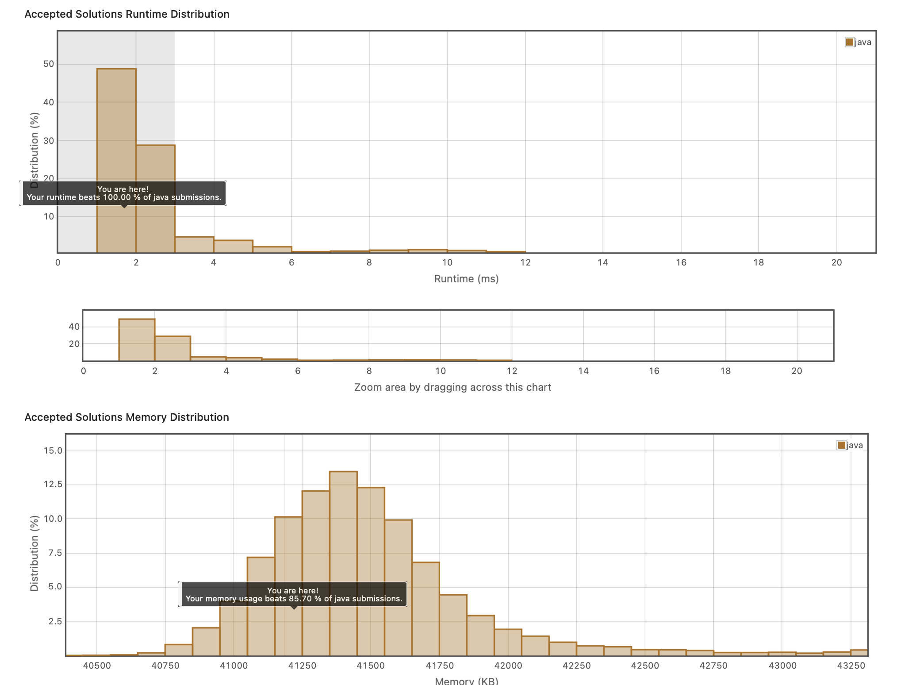

## 6. atoi
https://leetcode.com/explore/item/884

String을 정수로 바꾸는 코드. 여러 조건들을 통과해야한다.

조건들을 단순화하는 능력이 필요하다. 
핵심은 Character - '0'이 int가 된다는 점을 이용하는 것이다.

```java
class Solution {
    public int myAtoi(String s) {
        long result = 0;
        boolean isNegative = false;
        int index= 0;
        if(s.length() == 0)
            return 0;
        while(index < s.length() && s.charAt(index) == ' ')
        {
            index++;
        }
        
        if(index < s.length()){
            if(s.charAt(index) == '-'){
                isNegative = true;
                index++;
            }else if(s.charAt(index) == '+')
            {
                index++;
            }
        }
        
        while(index < s.length() && Character.isDigit(s.charAt(index)))
        {
            
            result = result * 10 + (s.charAt(index) - '0');
            index++;
            if(result > Integer.MAX_VALUE)
            {
                return isNegative? Integer.MIN_VALUE: Integer.MAX_VALUE;
            }
        }
        
        return isNegative? (int)result* -1: (int)result;
    }
}
```
