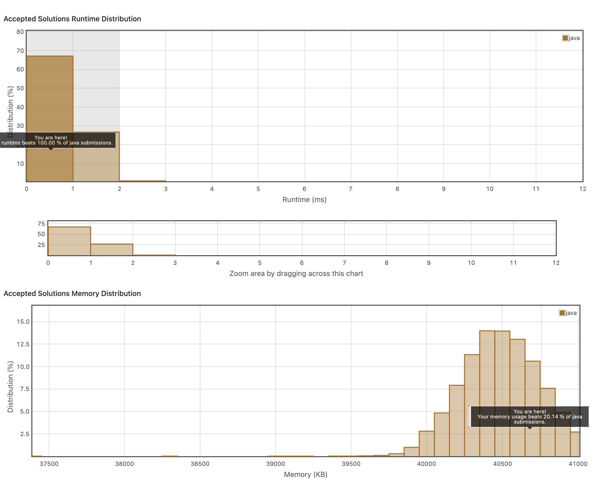

## 7. Find the Index of the First Occurrence in a String
https://leetcode.com/explore/item/885

haystack 내부에 needle을 포함하고 있다면 제일 먼저오는 needle의 인덱스를 반환하는 문제.
처음에는 haystack, needle의 인덱스 내용을 하나하나 비교하면서 풀려고 했는데, 그렇게 되니까 복잡해지는 것 같았다.

깔끔하게 haystack을 돌면서, 첫 글자만 비교하여 거기서부터 needle의 길이까지가 needle과 같은지를 비교했다.
```java
class Solution {
    public int strStr(String haystack, String needle) {
        for(int i = 0; i < haystack.length(); i++)
        {
            if(haystack.charAt(i) == needle.charAt(0)){
                if(i+needle.length() <= haystack.length() && haystack.substring(i, i+needle.length()).equals(needle)){
                    return i;
                }else{
                    continue;
                }
            }
        }
        return -1;
    }
}
```


시간 복잡도도 좋게 나왔다.