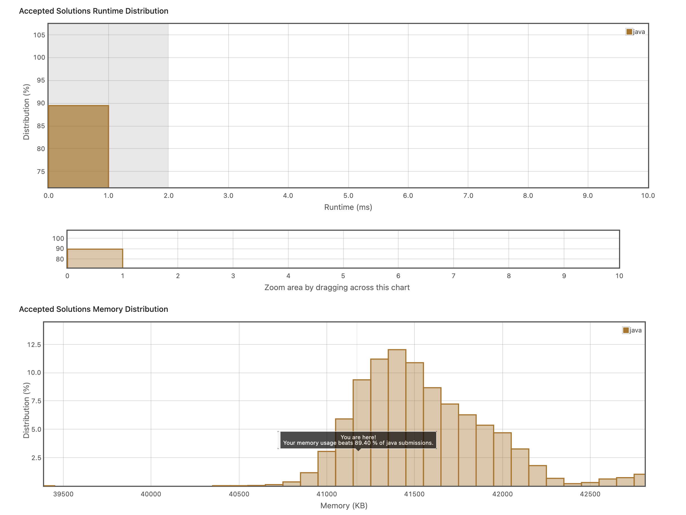

# 1. Maximum Depth of Tree
가장 깊은 트리를 발견하는 문제다. 
재귀로 푸는 것이 제일 나을 것 같아서 재귀로 풀었다.


```java
class Solution {
    public int maxDepth(TreeNode root) {
        int depth = 0;
        if(root == null){
            return 0;
        }
        if(root.left==null && root.right==null)
        {    
            return 1;
        }else{
            depth = 1+ Math.max(maxDepth(root.left), maxDepth(root.right));
        }
        return depth;
    }
}
```

```java
class Solution {
    
    public int maxDepth(TreeNode root) {
        if(root == null) return 0;
        
        return 1+Math.max(maxDepth(root.left), maxDepth(root.right));
    }
    
}
```
더 같단하게는 이렇게도 가능하다.