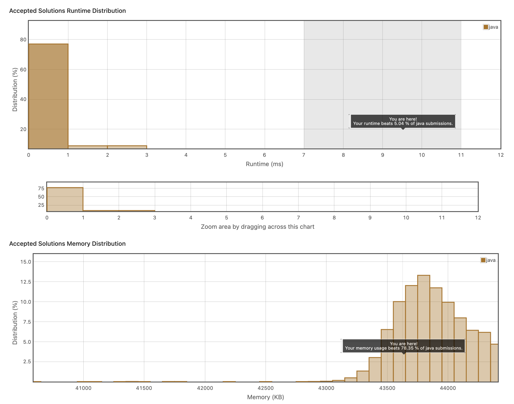

## 2. Validate Binary Search Tree
https://leetcode.com/explore/item/625
재귀밖에 떠오르지가 않아 재귀로 풀었는데 너무 느리다.
left 모든 값들보다 root가 커야하고, right 모든 값들보다 root가 작아야한다.

```java
/**
 * Definition for a binary tree node.
 * public class TreeNode {
 *     int val;
 *     TreeNode left;
 *     TreeNode right;
 *     TreeNode() {}
 *     TreeNode(int val) { this.val = val; }
 *     TreeNode(int val, TreeNode left, TreeNode right) {
 *         this.val = val;
 *         this.left = left;
 *         this.right = right;
 *     }
 * }
 */
class Solution {
    public boolean isValidBST(TreeNode root) {
        boolean result = false;
        if(root == null){
            return false;
        }
        if(root.right != null && root.left != null ){
            if(getSmall(root.right) > root.val && getBig(root.left) < root.val){
                // System.out.println(getSmall(root.right));
                
                return isValidBST(root.right) && isValidBST(root.left);
            }else{
                return false;
            }
        }
        if(root.left != null ){
            if(getBig(root.left) < root.val){
                return isValidBST(root.left);
                
            }else{
                return false;
            }
            
        }
        if(root.right != null  ){
            if(getSmall(root.right) > root.val){
                return isValidBST(root.right);
            }else{
                return false;
            }
        }
        
        result = true;
        return result;
    }
    public int getBig(TreeNode root){
        int val = root.val;
        if(root == null){
            return Integer.MIN_VALUE;
        }
        if(root.right != null){
            val = Math.max(val, getBig(root.right));
        }
        if(root.left != null){
            val = Math.max(val, getBig(root.left));
        }
        return val;
    }
    public int getSmall(TreeNode root){
        int val = root.val;
        if(root == null){
            return Integer.MAX_VALUE;
        }
        if(root.right != null){
            val = Math.min(val, getSmall(root.right));
        }
        if(root.left != null){
            val = Math.min(val, getSmall(root.left));
        }
        return val;
    }
}
```
중위 순환으로 아래와 같이 풀수있다. 해당 솔루션의 경우 0ms가 소요되었다.

```java
TreeNode prev = null;
    public boolean isValidBST(TreeNode root) {
        if(root == null) {
            return true;
        }
        
        if(isValidBST(root.left) && (prev == null || root.val > prev.val)) {
            prev = root;
            return isValidBST(root.right);
        }
        
        return false;
    }
```