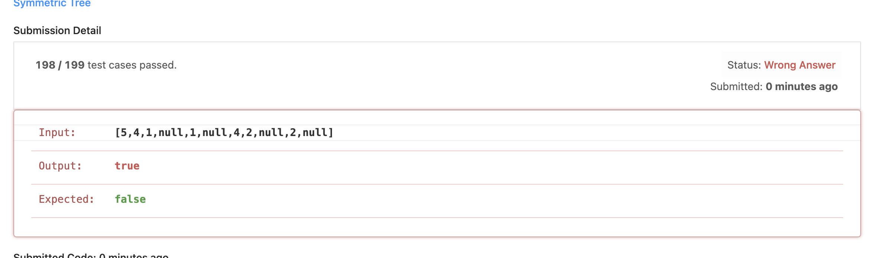

# 3.  Symmetric Tree
서로 대칭되는 트리인지 확인하는 문제인데, 나는 한참을 낑낑거렸다. 
스택에 왼쪽 트리를 쌓고, 오른쪽에서 pop하려고 했는데 영 잘 되지가 않았다. 

계속 이렇게 한개의 케이스에서 뻑이 났다. 분명 더 간단히 하는 방법이 있었으리라. 
여기서 느낀 점은, 동시에 비교해야하지 한쪽을 넣고 나중에 빼는 것은 효율적이지도 않고 효과적이지도 않다는 점이다. 

```java
/**
 * Definition for a binary tree node.
 * public class TreeNode {
 *     int val;
 *     TreeNode left;
 *     TreeNode right;
 *     TreeNode() {}
 *     TreeNode(int val) { this.val = val; }
 *     TreeNode(int val, TreeNode left, TreeNode right) {
 *         this.val = val;
 *         this.left = left;
 *         this.right = right;
 *     }
 * }
 */
class Solution {
    Stack<Integer> stack = new Stack();
    public boolean isSymmetric(TreeNode root) {
        saveValue(root.left);
        saveValue(root.right);
        System.out.println(stack.toString());
        return compareValue(root.right) && stack.isEmpty();
    }
    public void saveValue(TreeNode root){
        
        if(root==null){
            stack.push(101);
            return;
        }
        if(root.left == null && root.right == null){
            stack.push(root.val);
            return;
        }
        saveValue(root.left);
        stack.push(root.val);
        saveValue(root.right);
    }
    public boolean compareValue(TreeNode root){
    
        System.out.println(stack.toString());
        if(root == null){
            if(stack.peek() == 101){
                stack.pop();
                return true;
            }
            return false;
            
        }
        if(root.left == null && root.right == null){
            if(root.val == stack.peek()){
                stack.pop();
                return true;
            }
            return false;
            
        }
        
        
        if(compareValue(root.left) && 
           (root == null && stack.peek() ==101
            ||root.val == stack.peek())  ){
            stack.pop();
            return compareValue(root.right);
        }
        return false;
        
        
    }
}
```

```java
/**
 * Definition for a binary tree node.
 * public class TreeNode {
 *     int val;
 *     TreeNode left;
 *     TreeNode right;
 *     TreeNode() {}
 *     TreeNode(int val) { this.val = val; }
 *     TreeNode(int val, TreeNode left, TreeNode right) {
 *         this.val = val;
 *         this.left = left;
 *         this.right = right;
 *     }
 * }
 */
class Solution {
    
    Stack<TreeNode> stack1 = new Stack();
    Stack<TreeNode> stack2 = new Stack();
    // boolean result = false;
    public boolean isSymmetric(TreeNode root) {
        if(root==null){
            return true;
        }
        saveValue(root.left, stack1);
        saveRValue(root.right, stack2);
        return compareValue();
    }
    public void saveValue(TreeNode root, Stack<TreeNode> stack){
        stack.push(root);
        if(root == null)
        {return;}
        saveValue(root.left, stack);
        saveValue(root.right, stack);
    }
    public void saveRValue(TreeNode root, Stack<TreeNode> stack){
        stack.push(root);
        if(root == null)
        {return;}
        saveRValue(root.right, stack);
        saveRValue(root.left, stack);
        
    }
    public boolean compareValue(){
        
        while(!stack1.isEmpty() && !stack2.isEmpty()){
            TreeNode left = stack1.pop();
            TreeNode right = stack2.pop();
            if(left == null && right != null || left != null && right== null ){
                return false;
            }
            if(left != null && right!= null && left.val != right.val){
                System.out.println(left.val);
        System.out.println(right.val);
                return false;
            }
        }
        
        if(!stack1.isEmpty() || !stack2.isEmpty()){
            return false;
        }
        return true;
    }
}
```
위와 같이 동시적으로 저장해서 구할 수도 있고
```java
class Solution {
    public boolean isSymmetric(TreeNode root) {
        if (root == null) {
            return true;
        }
        return isMirror(root.left, root.right);
    }
    
    private boolean isMirror(TreeNode node1, TreeNode node2) {
        if (node1 == null && node2 == null) {
            return true;
        }
        if (node1 == null || node2 == null) {
            return false;
        }
        return node1.val == node2.val && isMirror(node1.left, node2.right) && isMirror(node1.right, node2.left);
    }
}
```
위와 같이 재귀적으로 풀어낼 수도 있다. 충분히 재귀적으로도 가능하다. 