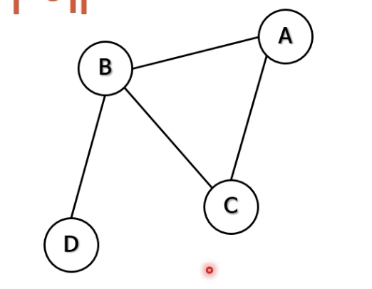
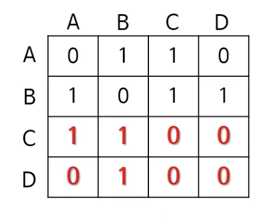
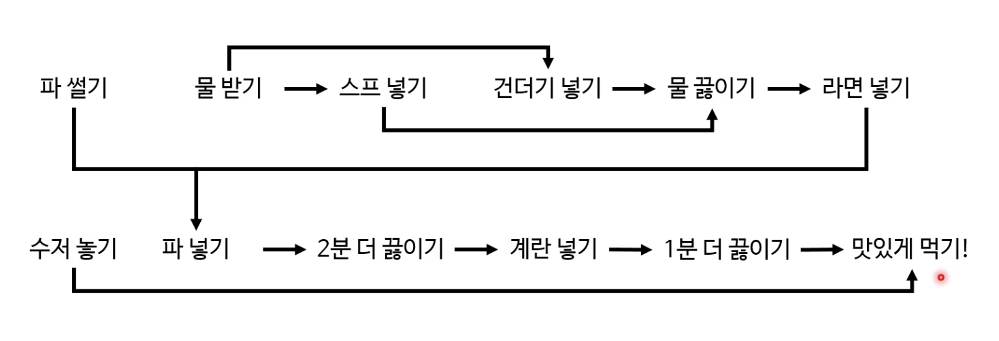
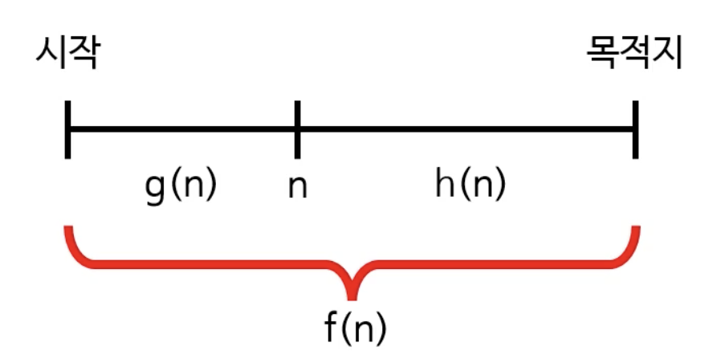
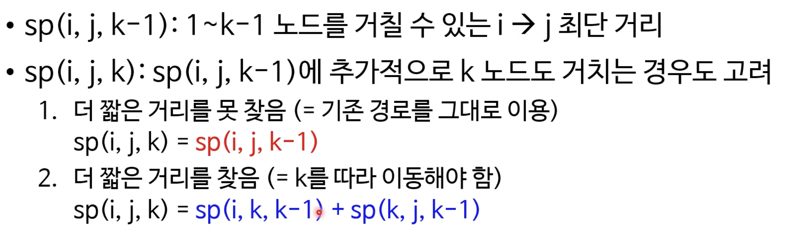
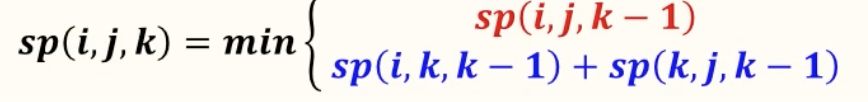
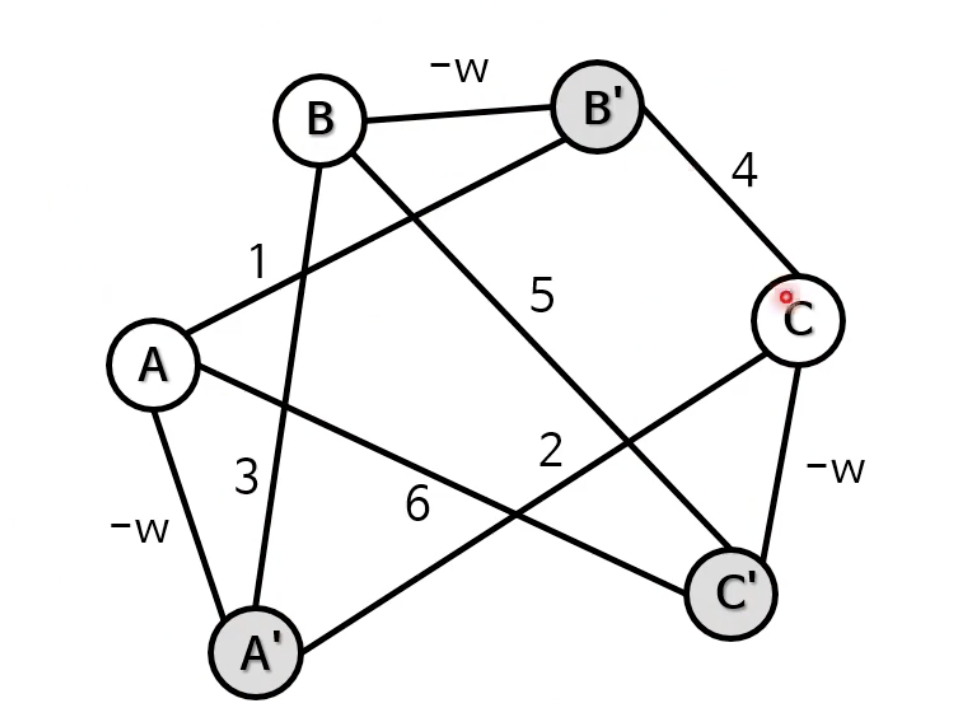
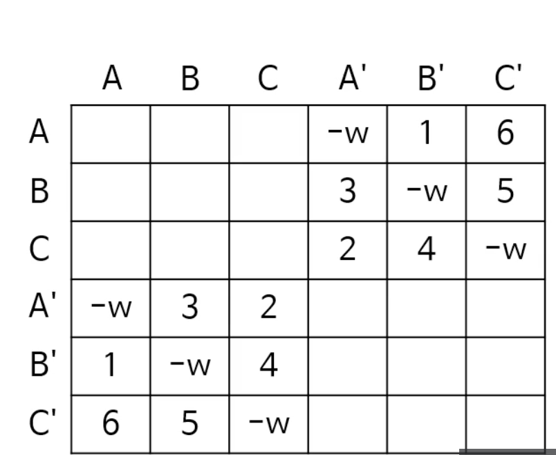
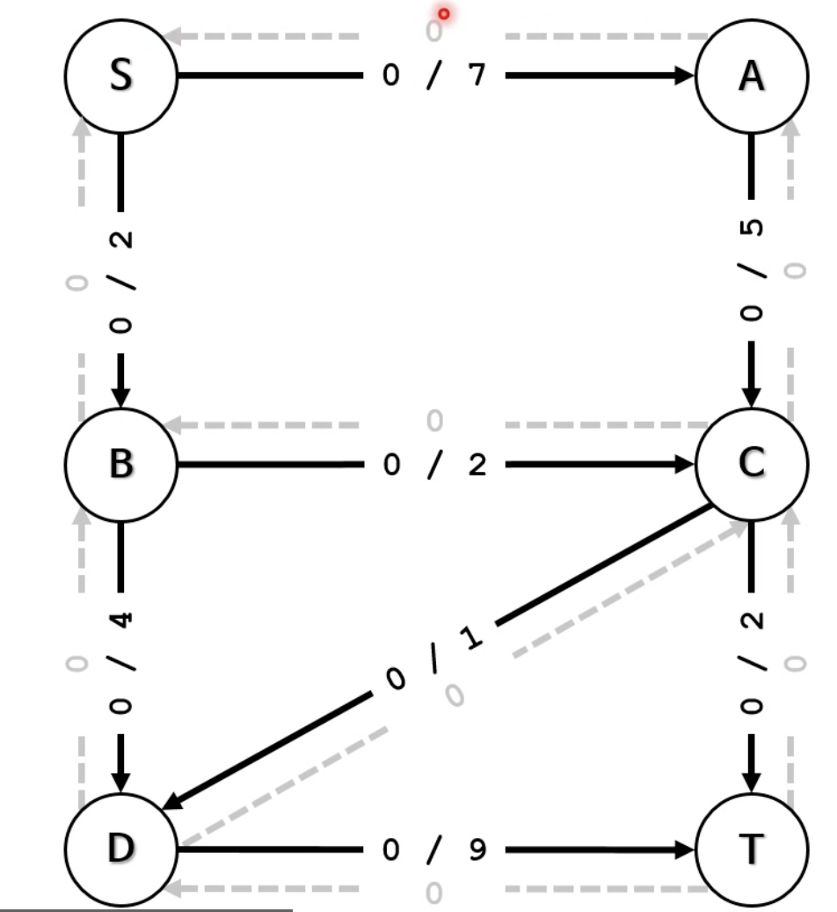
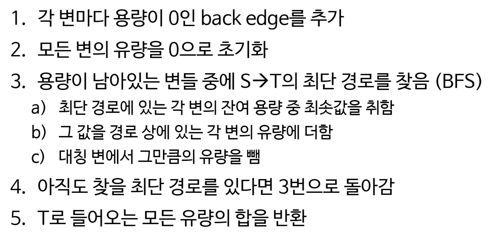

그래프는 실무적으로 알아두면 좋지만, 흔히 사용하지는 않는다. 
그렇기 때문에 잘못하면 탁상공론으로 갈 수가 있다. 

# 그래프란? 
데이터를 잘 정리하는 방법 중 하나라고 간단히 정의해볼 수 있다.

- 여기서 데이터란, 노드를 말한다. 정점이라고도 할 수 있다. 이 노드에는 아무거나 저장해볼 수 있다. 무엇을 저장하든 상관이 없다. 
- 잘 정리한다는 것의 뜻은 노드 간의 관계를 정리한다는 것이다. 이 관계란, 직접적인 관계를 말한다. edge라고도 부를 수 있고, 간선이라 부를 수도 있다. (or link, line) 그런데, 관계는 어떤 것이든 상관없다.

예로는 서울 지하철 노선표같은 것이 있다. 전/현 직장동료와 같이 네트워크를 표현하기도 하고, 세탁기 사이클도 그래프로 나타내볼 수 있다. 

그런데, 트리와 좀 비슷한 느낌이기도 하다. 사실 트리는, 그래픽의 특수한 모습이다. (방향 비순환 그래프)

사실, 그래프는 이전의 자료구조들을 일반화한 것이라 할 수 있다. 

정리하자면, 그래프란 데이터들과 그 관계를 보여주는 방법 중 하나다. 이들은 서로 연관 있는 노드의 집합이다. 네트워크 형태의 관계를 보여주기에 적합하다. 복잡한 실세계의 문제를 모델링하기에 적절하다. 그래프 이론을 적절히 적용하면, 시간 복잡도를 확연히 줄일 수가 있다. 

## 그래프의 종류
1. 방향 vs 무방향 그래프

방향이라는 건 화살표가 있다는 것, 엣지가 한 방향만 가리킨다. 

무방향 그리프는 엣지에 특별한 방향이 없어서 양방향을 가리키는 것과 같다. 
무방향 그래프의 최대 엣지 개수는 n(n-1)/2다. 

2. 순환 vs 비순환 그래프

비순환 그래프는, 일단 떠나면 다시 그 노드로 돌아오는 경로가 없고 순환 그래프는 있다. 

3. 가중 vs 비가중 그래프 

모든 엣지가 동일한 의미를 가지는 것이 비가중 그래프다. 가중 그래프는 관계 정도가 서로 다르다. 

## 그래프의 다양한 표현 방법
이 그래프를 사용하면 스케줄링이나, 여행 경로, 원자 결합 등의 다양한 문제를 풀 수 있다. 

그런데 원과 선으로 그려놓는 그래프를 어떻게 코드로 옮겨야할지가 문제다. 

이를 표현할 때, 인접 행렬이나 인접 리스트로 표현하게 된다. 
1. 인접행렬: N x N 행렬, 서로 인접한 노드를 표현한다. 
 
위의 그래프를 행렬로 바꾸면 4 * 4 행렬이 된다. 


만약 방향 그래프라고 할지라도 크게 다르지는 않다. 

이 인접행렬은, 

장점은 
1. 쉽게 구현할 수 있고
2. 변 제거의 시간 복잡도가 O(1)이다.. 
3. 관계를 쉽게 찾는다. 

단점은
1. 공간을 더 차지하고
2. 언제나 같은 공간을 차지한다. 심지어 노드가 연결이 많이 없더라도!
3. 인접 행렬을 만드는 시간이 O(N^2)이고 인접 노드를 찾는 시간이 O(N)이다.

2. 인접 리스트

각 노드마다 이웃의 리스트를 만든다. 
연결리스트 N개를 배열에 저장하는 방식이다. 

이의 장점은 공간을 적게 사용하고, 삽입과 삭제가 빠르다는 것이다. 

노드 a에서 b로 가는 엣지가 존재하는가? 에 대한 답변이 O(1)보다 느리다. 

## 그래프의 깊이 우선 탐색
그래프에서 깊이 우선 탐색을 트리에서처럼 진행하면 무한 루프가 생긴다. 

따라서, 이미 처리했던 노드를 다시 처리하면 안된다. 방문한 노드를 기억해야한다.
1. 전역적으로 방문했던 노드를 기억하거나
2. 각 노드마다 방문했는지 여부를 기억한다. 

두번째 방문 시 처리하지 않고 곧바로 다음 노드로 넘어가게끔 표현한다. 

스택에 이미 들어간 노드는 다시 넣지 않게하는 것이 올바른 노드 기억법이다. 

```java

public static void searchDepthFirst(Node node){
    HashSet<Node> discovered = new HashSet<>();
    Stack<Node> stack = new Stack<>();

    stack.push(node);
    discovered.add(node);

    while(!stack.empty()){
        Node next = stack.pop();

        System.out.println(next.data);

        for(Node neighbor : next.neighbors){
            if(!discovered.contains(neighbor)) {
                stack.push(neighbor);
                discovered.add(neighbor);
            }
        }
    }
}
```


그런데, 방향 그래프에서는 그래프의 모든 노드를 방문할 수 없을 수가 있다. 그래서 DFS의 인자로 모든 노드 목록을 전달해서 방문할 수 있게끔 한다. 이미 처리한 목록이 있기에 중복 방문은 없다. 따라서 속도가 엄청나게 느려지지는 않는다. 

그래프의 각 노드에 대해 
1. DFS 함수를 호출하고
    - 현재 노드를 발견한 것으로 표시하고
    - 처음 발견한 이웃 노드마다 DFS를 호출한다.
2. 현재 노드를 방문한다

시간복잡도는 O(N + E), 노드 수 + 엣지 수

트리 또한 N+E지만 줄여서 O(N)이라 표현

## 위상정렬 
그래프 알고리듬이다. 그나마 간단한 그래프 알고리듬.

순서가 복잡한 노드끼리의 순서를 정할 수 있다. 비순환 방향 그래프에서만 유효한 위상 정렬이 가능하다. 

아래는 위상정렬의 예다.


- 몇가지 알고리듬이 존재하는데, 깊이 우선 탐색과 칸 알고리듬이 그 예다. 

### DFS를 활용한 위상정렬
전위 순회와 후위 순회가 있는데, 전위 순회는 올바르지않다. 

후위 순회는 끝 단계부터 시작한다. 
후위순회를 한 뒤에, 역순으로 실행하면 된다. (스택을 활용해서)

이 위상 정렬은 관계에서 순서를 정하는 매우 많은 곳에 사용이 가능하다. 

- 프로젝트 일정 만들기
- cpu 명령어 실행 순서 결정
- 컴파일 순서 결정 
- 선수 순위 결정 등

굉장히 막강한 알고리듬이다. 

## 강한 결합 요소
그래프로 이어진 곳에서 끊긴 곳이 있을 때, 어디를 연결해야 막히지 않을까? 

그와중에 서로 순환관계를 갖는 노드들이 있다. 이를 강한 결합 요소라고 한다. 

이런 요소들을 하나로 묶어서 한 노드로 생각하면 단순해진다. 여기서 진입 차수가 0인 노드에 연결해주면 된다. 

정리해보자면
- 방향 그래프에서 끈끈한 관계를 가지는 노드들의 최대 그룹이다.

처음부터 그래프 연결을 시도해야한다고 해봤을 때, 
위상 정렬을 사용하면 된다. 강한 결합으로 노드를 만들고, 이 노드들끼리 비순환 그래프를 만들면 된다. 

### 코사라주 알고리듬
1. 그래프 G를 DFS 후위 순회를 하고, 역순으로 돌린다. 
2. 그래프 방향을 반대로 바꿔준다. 
3. 역순으로 돌린 순서대로 DFS를 실행한다. 

더 갈 수 없는 노드가 있다면 그것이 강한 결합 요소 노드라고 결정한다. 

### 강한 결합 요소의 용도
- 주로 복잡한 네트워크 관계 관련
- 방대한 양의 데이터에서 연관된 그룹 찾기에 유용하다.

## 너비 우선 탐색
```java

public static void searchBreadthFirst(Node node){
    HashSet<Node> discovered = new HashSet<>();
    Queue<Node> queue = new LinkedList<>();

    queue.add(node);
    discovered.add(node);

    while(!queue.empty()){
        Node next = queue.remove();

        System.out.println(next.data);

        for(Node neighbor : next.neighbors){
            if(!discovered.contains(neighbor)) {
                queue.add(neighbor);
                discovered.add(neighbor);
            }
        }
    }
}
```

### 최단 경로 찾기
- 가장 간단하게는 주먹구구식으로 찾으면 된다. 그러나 이는 엄청난 시간 복잡도를 가진다. 
- BFS를 사용하면 최단 경로를 찾을 수 있다. 시간 복잡도도 O(N+E)다.
- 현재 깊이의 모든 노드를 방문 후 다음 깊이로 진행하게 되므로, 깊이 n을 뒤지다보면 d 노드를 찾게된다. 그래서 언제나 최단 경로를 찾는 방법이다. 

따라서, BFS로 최단 경로를 찾는 것이 좋은데, 
코드를 조금 수정해야한다. 시작점에서부터 현 노드까지의 거리를 기억해야하기 때문이다. 

저장법은 
- 해시 맵에 모든 노드 거리를 저장하거나
- 2D 배열로 저장한다. 
- 각 노드 안에 거리를 저장한다. 

```java

public static int findShortestDistance(Node s, Node d){
    HashSet<Node, Integer> distances = new HashSet<>();
    Queue<Node> queue = new LinkedList<>();

    queue.add(s);
    distances.put(s, 0);

    while(!queue.isEmpty()){
        Node next = queue.remove();
        int distance = distances.get(next);

        if(next.equals(d)) {
            return distance;
        }

        for(Node neighbor : next.neighbors){
            if(!distances.containsKey(neighbor)) {
                queue.add(neighbor);
                distances.put(neighbor, distance + 1);
            }
        }
    }
    return -1;
}
```

- 추적을 위해 추가 정보가 필요하다. 선행 노드와 같은! 

### 각 변의 거리가 다른 최단 경로를 찾기
이는 BFS로 간단히 해결할 수는 없다. 

### 다익스트라 알고리듬
위의 사례일 경우, 두 노드 사이의 최단 경로를 찾는다. 

- 방대한 노드 네트워크에 사용하기 충분히 빠르다. 
- 변의 가중치가 음수인 경우에는 제대로 작동하지는 않는다. 

개념상으로, 모든 노드를 한번씩 방문하며 아래의 연산을 하게된다. 
1. 아직 방문하지 않은 노드 중 가장 가까운 노드 n을 선택한다. 
2. n의 각 이웃 노드 m으로 여행하는 거리를 계산한다. 
3. 이 결과가 m의 기존 거리보다 가까우면 m의 거리를 업데이트하게된다. 

그리고, 모든 노드를 방문하면 최단 거리를 찾는다. 

이건 동적 계획법의 한 사례다. 
인접행렬을 사용해서, 거리를 계산하고 최종 최단 거리를 기재해둔다.

그런데 이 인접행렬에 문제가 있다.
노드는 수백만개인데 변은 사실상 몇개가 되지 않는다면, 시간복잡도가 너무 커진다. 
그럴 때는 어쩔 수 없이 인접 리스트로 만들 필요가 있다.

### 다익스트라 알고리듬 시간복잡도
- 방문하는 노드 수 (= 알고리듬 실행 횟수): N 
    - 최소 거리 노드 선택도 그 안에서 N번을 할 수 있다.
    - 그런데 자료구조 괜찮은 것을 사용하게 된다면 log N도 가능.
- 모든 변을 한번씩은 지나감: E
    - 거리 값을 업데이트 하는 것: 1
    - 그런데 힙 자료구조 사용하게되면 이 업데이트도 log N이 된다. 

- 따라서 개선되기 전에는 O(N^2 + E)
- 개선 후에는 O(NlogN + ElogN)

이보다 더 빠른 자료구조는 원론적으로 있다. 그것은 피보나치 힙이다. 우선 순위를 다시 정렬하는 시간이 O(1)이다. 최악의 경우에는 O(N)
- 그런데 코드로 옮기기 복잡하고, 실제 실행 속도는 생각보다 빠르지 않을 수도 있다는 문제가 있다. 

### 다익스트라와 음의 가중치
다익스트라는 음의 변이 있으면 오작동한다. 이는 언제나 변의 가중치가 양수라 가정한 알고리듬이다. 다음 거리는 언제나 이미 방문한 거리 이상이어야한다.

엣지가 음수를 가지면, 방문한 거리 이상이 될 수 없다.
이를 처리하는 벨만-포드 알고리듬이 있다.

---
## A* 알고리듬
정말 많이 쓰는 경로찾기 알고리듬이다. 다익스트라랑 비슷하다.

- 다익스트라는 훌륭하다. 언제나 목적지까지의 최단 경로를 찾아준다. 시간 복잡도도 훌륭하다. 그런데 실제 정말 똑똑한 알고리듬인지 그려본다면? 
- 그렇게 똑똑하지는 않다. 일단 너비 우선 탐색이기 때문이다.

A* 알고리듬은 다익스트라보다 훨씬 빠르다. 
- 쓸데없는 계산을 피한다. 
- 이를 위해 다음 노드 선택시 기준을 하나 더 추가하게된다. 다익스트라의 경우 시작점부터 노드까지의 거리를 기준으로 노드를 선택한다면, a*는 그 노드로부터 목적지까지의 거리를 기준으로 추가한다. 
- 그런데 이 경우, 목적지까지 탐색을 다 하기 전까지는 확실히 모른다. 따라서 A*가 추가한 기준은 결정적이지 않다. 휴리스틱이나 근사치를 따라 추가한다. 이 휴리스틱 함수에 따라 성능이 달라진다. 대부분의 경우 다익스트라보다 빠르다. 하지만, 데이터에 따라 느릴수도 있다. 

### A*의 노드를 선택하는 두가지 기준

- g(n)은, 시작노드로부터 노드 n까지의 거리 (실제 값)이다.
- h(n)은, n부터 목적지 노드까지의 거리를 말한다. (추정치)
- f(n)은, 시작 노드부터 목적지 노드까지의 거리를 말한다 (추정치) = g(n) + h(n)
- 다음 노드 선택 시 다익스트라는 g(n)이 최소인 것을 선택하고, A*는 f(n)이 최소인 것을 선택한다. 

결국 h(n)에 따라 값이 달라진다. 
- 계속 목적지 방향으로 나아가게된다. 목적지 쪽에 있는 노드를 우선적으로 선택하고자 한다. 그러므로 목적지쪽에 있는 노드의 h(n)이 더 작아야한다.
- 모든 상황에 최고인 함수는 없다. 
- OPEN이라는 이름의 노드 집합이 있고, 그 안에 있는 후보 선택시 최소가 되는 f(n)을 이용한다. 같은 노드를 두 번 이상 방문할 수 있다.

### A* 알고리듬
1. 그래프에 있는 모든 노드의 g(n), f(n)을 무한으로 초기화한다.
2. g(s) = 0, f(s) = h(s)
3. 시작 노드 s를 OPEN에 추가한다.
4. OPEN에서 f(n)이 가장 작은 노드를 찾아 제거한다. 
5. n의 각 이웃 m에 대하여 시작점 -> n -> m이 더 짧은 경로라면 g(m)을 업데이트하고 m을 OPEN에 추가한다.
6. 목적지에 도달하거나 OPEN이 빌 때까지 4-5번 과정을 반복한다.

실제로 최단거리를 주지 못할 수가 있다. 그러나 굉장히 빠르다. 

- h(n)이 어떤지에 따라 실제 결과가 다를 수있다.
- h'(n): n이 실제로 목적지로 이동하는 거리
- 만약 h(n)이 영이라면, f(n) = g(n)이므로 다익스트라 알고리듬과 다를바가 없고, 
- h(n) <= h'(n) 이라면 h(n)을 허용할 수 있다고 한다. A*는 항상 최단 거리를 찾게 되어있다. 정확도와 속도가 전부 양호하게 나온다. 
    - 그 이유는 만약 길다고 했으면 옆에 노드도 확인하며 엉뚱하게 가는데, 작게되면 최적으로 완료하게 되기 때문이다.
- h(n) << h'(n) 즉, 엄청나게 작아진다면 h(n)의 중요도가 줄어들게되고 탐색 범위가 넓어진다. 속도도 느려진다. 다익스트라의 영향이 커지기 때문이다.
-  h(n) = h'(n)이면 언제나 최고의 경로를 따라가고 알고리듬도 매우 빠르다.

### A*가 중복 방문을 허용하는 이유
다익스트라의 경우 새로 방문하는 노드의 실제 거리가 최소값이었다. 그러나 A*는 새로 방문하는 노드의 거리가 실제 거리가 아니므로, 지금 최소 거리라 믿고 뽑는 노드가 실제로는 최소가 아닐 수도 있다. 

만약 h()이 특정 조건을 만족하게되면 노드를 한번씩만 방문하게된다. 
- 일관적이거나 단조롭다고 표현한다. 
- 특정 조건: h(n) <= dist (n, m) + h(m) 일 경우에!

### A* 시간 복잡도
여러 요소에 따라 달라진다. 휴리스틱 함수 h(n)과 OPEN에 사용하는 자료구조에 따라서. 

- h(n)이 O(1)이거나, OPEN이 피보나치 힙을 사용할 경우에는 시간복잡도가 다익스트라와 같아진다. 

---
## 모든 쌍의 최단 경로 찾기 - 플로이드 워셜 알고리듬
- 모든 쌍의 최단거리를 찾는 알고리듬 중 하나다.
- 다익스트라에서는 1D 배열이었다면, 플로이드 워셜은 2D 배열이다. 
- 동적 계획법 알고리듬이다. 
- 기본 원리는 
    - u->v가 최단 경로인 경우
    - 중간에 거치는 M 노드에 대해
    - u->m, m->v가 최단경로여야한다.

방식은,
1. 그래프에 잇는 노드를 1에서 N까지 번호를 매긴 후,
2. sp(i,j,k)를 정의한다. i->j의 최단 경로고, 중간에 1~k 노드를 거쳐도 된다. 이건 sp(i,j,k-1)의 확장이다. 


공식은 아래와 같다.


### 플로이드 워셜의 복잡도
2D 배열을 훑어야하므로 O(N^2) 
k마다 배열을 훑어야하므로 O(N)을 곱해주어야한다.

공간복잡도는 2D 배열만큼인 O(N^2)이다.

약간 느린 감이 있으나 노드 수가 많지 않으면 괜찮다.

---
## 최소 신장 트리
신장 트리란, 어떤 그래프 안에 있는 모든 노드를 연결하는 트리다.

최소신장 트리란, 신장 트리 중 비용이 최소인 트리다. 
이 트리에서 엣지는 N-1개다 (N은 노드일 경우)

cycle이 있으면 안된다. 

- cut 개념: 어떤 그래프를 서로소인 두 하위 집합으로 나누는 행위다. 그래프의 노드들을 두 그룹으로 분리시킨다. 그들을 연결하는 변들의 집합이 컷 세트다.

- cut을 한 두 하위 그래프가 있는데, 그들을 연결하는 엣지는 가장 가중치가 작다. 

### MST 기본 원리
1. 그래프에 있는 노드 중 한 변을 확인한다.
2. 이 변이 MST에 들어가야하는지 검사한다. (이 때 cut property를 사용한다)
3. MST의 모든 변을 찾지 못했다면 1로 돌아간다. 

이는 그리디 알고리듬의 한 예다. 대표적 알고리듬으로 크러스컬 알고리듬이 있다.

### 크러스컬 알고리듬
1. 그래프의 각 노드마다 그 노드만 포함하는 트리를 만들고
2. 모든 변을 가중치의 오름차순으로 정렬한다. -> 배열을 만들어낸다..
3. 배열이 비거나 MST가 완성될때까지 
    - 배열에서 가중치가 가장 작은 변을 제거해서 고려한다.
    - 이 변이 두 트리를 연결하는지 검사한다. (서로소 집합의 Find(u) != Find(v)일 경우)

### 서로소 집합
변이 두 트리를 연결하는지 검사를 어떻게 하는가? 가 해당 알고리듬에 제일 어려운 부분이다.

이를 위해서는 서로소 집합 자료구조를 사용해야한다. 
- 합집합 찾기 자료구조라고도 한다.

겹치지 않는 집합들을 저장하는 자료 구조라고 하며, 서로 다른 트리는 겹치지 않는다. 

#### 연산들
- MakeSet(element): 새로운 집합을 만든다.
- Find(element)
- Union(element1, element2): 두 집합을 합친다.

#### 시간 복잡도: O(ElogE)

---
## 외판원 문제
- 이동거리를 최소화 하는 문제다. 
- 그런데 시간 복잡도가 값을 정확히 할 경우
    - 주먹구구식: O(N!)
    - 헬드 카프 알고리듬: O(N^22^N)
    - NP 난해문제다

- 그렇기에 근사 알고리듬으로 풀어낸다. 그나마 쉬운 것으로 정리할 예정이다.

### TSP 그래프
- 무방향 그래프
- 완전 그래프
- 변의 가중치는 음수가 아니다.
- 변의 가중치는 삼각 부등식을 만족시킨다. 제일 긴 변보다 나머지 두 변의 합이 크다는 개념이다.

여기서, 모든 도시를 한번씩 방문하는 경로를 찾아낸다. 이를 해밀턴 경로라고도 한다. 원래 노드에까지 돌아오면 해밀턴 순환이다. 

최소비용인 해밀턴 순환을 찾아야한다. 

### 2-근사 알고리듬
아무리커도 최소 비용보다 2배인 경로를 찾게되는 알고리듬이다. 

이는 삼각 부등식을 만족하는 TSP에 사용할 수 있다. 

굉장히 간단하다.
1. MST를 만든다.
2. MST를 한바퀴 돈다. -> 아무리 느려도 각 변을 두번 방문하는 게 끝이다. 이미 방문한 노드는 건너 뛴다.
    - DFS 전위 순회 + 후위 순회로 경로를 배열에 저장해둔다.
    - 해당 배열 순서로 그래프를 돌면서, 이미 방문한 노드는 건너 뛰고 방문하게 되면 MST를 한바퀴 도는 것보다 최적화가 가능하다. 

- 시간 복잡도: E log E

### TSP 알고리듬 실 사용례
- 여러 장소 방문 문제
- 효율적인 공정 계획
- DNA 염기서열 분석

### TSP 꼼수
변형을 해볼수도 있다.
1. 완전 그래프가 아닌 경우에는 연결 안된 노드들을 연결 후 새 변의 가중치값을 몹시 높게 설정한다.
2. 비대칭일 경우: 어떻게든 대칭으로 만들어보려고  아래와 같이 가상의 노드를(고스트 노드) 만들고, 대칭 TSP로 변환시켜 표를 만든다. 실 노드끼리의 연결은 무한대로 만들어서 선택되지 않게끔한다. 이후 TSP 알고리듬을 실행한다.



이렇게 하는 이유는 노드와 고스트를 하나로 보겠다는 뜻이다.

### 삼각 부등식이 성립하지 않는 TSP
- 다항식 안에 괜찮은 해법을 찾을 수 없다. 근사 알고리듬이 있어도 마찬가지다. 

---
## 최대 유량
최대 유량을 풀기위해 사용하는 flow network
- 방향 그래프를 가정한다. 
- 어떤 것의 지속적인 이동을 표현하기에 적합하다. 

최대유량 문제란, 어떤 노드에서 다른 노드까지 보낼 수 있는 최대 양을 결정하는 문제다.
- 병렬 연결 덕분에 유량이 늘 수가 있고, 
- 병목점 때문에 유량이 줄수가 있다.

여러 알고리듬이 있다. BFS도 있다.

### 에드몬드-카프 알고리듬
그러나 효율적인 대표 알고리듬은 에드몬드-카프

- 기본 개념
각 변의 유량을 0으로 초기화하고,

경로가 아직 있다면, 시작점에서 도착점까지의 최단 경로를 찾는다. 그리고 최단 경로를 통해 보낼 수 있는 최대 유량을 각 엣지에 더하게된다. 
그리고 이 과정을 계속 반복한다. 

그런데 이 방법은 제일 처음 찾은 최단 경로가 더 나은 선택지를 고르지 못하게끔 한다. 

이를 해결하기 위하여서는 역방향 edge를 이용해야한다.
- 유량을 분산시키기위해 사용하는 꼼수다. 
- 이미 존재하는 변과 방향이 반대인 가상의 변을 만든다. 용량은 0으로 설정한다. 


- 원래 변에는 최대 용량을 더하고
- back edge에는 최대 용량을 뺀다. 



이 최대 유량 문제 예시는
- 순환 수요문제
- 항공운행 스케줄 짜기 문제
- 프로젝트 선택을 어떤 것을 할지를 결정하는 문제
- 등 생각보다 많다.

## 그 외 중요한 그래프 
1. 클릭
2. 그래프 색칠
3. 독립집합
4. 이분 그래프
5. 정점 커버
6. 매칭 등

- 이들이 NP 완전 문제들이다. 