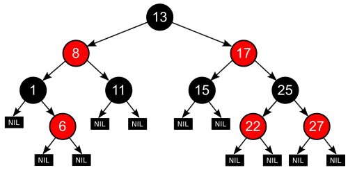

트리는 실무에서 많이 사용된다. 
## 관련 용어
1. 노드: 실제로 저장하는 데이터 (루트: 최상위, 리프: 마지막에 위치한 데이터들)
2. 부모는 언제나 하나. 
3. 자식은 없을수도있고, 많이 있을수도 있다. 
4. 조부모, 삼촌, 형제자매 등도 있다.
5. 깊이: 노드에서 루트 경로의 길이를 말한다.
6. 높이: 노드에서 리프 경로의 최대 길이를 말한다. 
7. 하위 트리: 어떤 노드 아래의 모든 것을 포함하는 트리

## 하위트리에서 볼 수 있듯이, 트리는 재귀적 자료구조다.

## 트리의 저장법
1. 부모와 자식 모두 노드
2. 부모와 자식 1:N 관계이므로, 부모가 자식을 참조하는 방식이 직관적이다.
```java
public class Node {
    public int data;
    public ArrayList<Node> children;
}
```

그런데 자식이 최대 둘인 트리라면, 굳이 `ArrayList` 가 필요없을 것이므로, left, right 노드 자식을 만든다. 이를 이진트리라 한다.

```java
public class Node {
    public int data;
    public Node left;
    public Node right;
}
```
자식이 하나만 있어야하는 트리라면? 사실상 연결리스트다. 

## 트리의 용도
트리는 굉장히 많이 사용되는데, 계층적인 구조라면 트리로 되어있다.
- HTML이나 XML의 문서 개체 모델을 표현한다. 
- JSON, YAML 처리 시 계층 관계를 표현한다.
- 프로그래밍 언어를 표현하는 추상 구문 트리
- 인간 언어를 표현하는 파싱 트리

## 
이진 탐색 트리(BST)
이진 트리 중에서도, 특수한 형태다. 
트리 하면 사람들이 가장 많이 사용한다. 

어떤 탐색에 특화된 이진 트리를 만드는 것이다. 규칙을 가지고 노드를 구성한다. 
예를 들자면, 왼쪽 자식은 언제나 부모보다 크다와 같은 규칙을 만들 수 있다. 

이렇게 이진 탐색 트리를 만드는 것 = 정렬되었다고 표현한다. 
정렬되다보니, 정렬에 효율적인 알고리듬을 사용할 수 있다. (ex. 이진탐색)

## BST 탐색

정렬된 배열과 다른 것은, 탐색 전에 따로 정렬이 불필요하다. 
데이터 추가 시 정렬된 위치에 추가한다. 

탐색과 평균 삽입 삭제 시간이 logn이다. 
메모리는 보다 크다. 

이를 탐색하기 위해서는, 기본적으로 이진 탐색과 동일한데, 차이점이 있다. 각 노드마다 두 하위 트리로 이분된다. 
하위 트리로 내려갈 때마다 검색 공간이 절반씩 줄어든다. 그래서 logn이다. (평균) 그런데, 최악일 경우? O(n), 분할되지 않고 한쪽으로 쏠리기만 할 때! 

```java
public class Node getNodeOrNull(Node node, int data) {
    if(node == null){
        return null;
    }
    if(node.data == data){
        return node;
    }
    if(data < node.data){
        return getNodeOrNull(node.left, data);
    }
    return getNodeOrNull(node.right, data);
}
```

## BST 삽입
### 전략
1. 새로운 노드를 받아줄 수 있는 부모 노드를 찾음. 그런데 새로운 노드를 받아줄 수 있는 부모란? 오른쪽 하위트리로 내려가야하는데, 오른쪽 자식이 없는 부모 혹은 왼쪽 하위 트리로 내려가야하는데 왼쪽 자식이 없는 부모
2. 그 후 자식으로 추가

이 삽입은 실제 나무와 비슷하다. 
```java
public static Node insertRecursive(final Node node, int data) {
    if (node == null){
        return new Node(data);
    }
    if(data < node.data){
        node.left = insertRecursive(node.left, data);
    } else{
        node.right = insertRecursive(node.right, data);
    }
    return node;

}
```

## BST 삭제
그냥 노드를 냅다 삭제하는 것이 아니라, 노드를 삭제한 뒤에도 올바른 BST를 유지하기 위해서는 정렬된 배열에서 값을 하나 삭제하듯 처리해야한다. 

### 전략
1. 지울 값을 가지고 있는 노드를 찾는다.
2. 그 바로 전 값을 (혹은 후 값을) 가진 노드를 찾는다. 전 값의 경우 왼쪽 하위 트리의 가장 오른쪽 리프
3. 두 값을 교환한다. 

지울 값을 가지고 있는 노드를 찾고, 그 바로 전 값을 가진 노드를 찾고 두값을 교환하고 리프 노드를 삭제한다. 

## 트리 순회
하위 트리와 비교했을 때 현재 노드의 방문 순서! 
- 전위순회: 루트->왼쪽->오른쪽
- 중위: 왼쪽->루트->오른쪽
- 후위: 왼쪽->오른쪽->루트

### 전위순회
용도: 트리를 복사할 때, 부모가 있어야 자식도 추가할 수 있다. 부모를 먼저 나열하고, 다른 순회는 부모가 중간 혹은 마지막이기 때문에, 전위 순회는 좀 더 복사를 직관적으로 할 수가 있다.
또한, 수식을 표기할 때, 연산자 괄호의 우선순위가 없어서 읽는 순서대로 스택에 쌓아 컴퓨터로 계산하기 좀 더 편하게 된다. 이를 폴란드 표기법이라고 한다. 
(근데 사실 이건 후위가 우리에게는 더 편하다.)

- 리프보다 루트를 먼저 봐야하면 전위 순회
- 리프 다 보고 다른 노드를 봐야하면 후위 순회 (그래프에서 자주 쓰인다.)
- 순서대로 봐야한다면 중위 순회

### 결론: BST는 이진 트리에 규칙을 더한 것이다. 왼쪽 자식은 언제나 부모보다 작고 오른쪽 자식은 언제나 부모보다 크다.

## 레드-블랙 트리
각 노드가 레드 혹은 블랙이다. 노드에 저장하는 데이터가 아니라, 1비트짜리일 뿐이다. (편의를 위해 색을 칠하는 개념이다.)

제일 중요한 건, 이 트리가 스스로 균형을 잡는 트리라는 것이다. 
이 균형을 통해 트리 높이를 최소로 보장하게 된다. 균형을 잡는 시점은, 삽입과 삭제할 때다. 

균형을 잡기 때문에, 탐색속도가 BST보다 빠르다.

### 레드-블랙 트리의 속성



1. 모든 노드는 레드 혹은 블랙이다.
2. 널 포인터도 리프 노드로 본다.
3. 루트 노드는 블랙이다. 
4. 모든 리프 노드는 블랙이다.
5. 레드 노드의 자식은 모두 블랙이다.
6. 어떤 노드와 리프 사이에 있는 블랙 노드 수는 동일하다. 이는 블랙 노드에만 있는 제약이고, 이를 통해 블랙과 레드 노드 수의 균형을 맞추고 이를 위해 삽입과 삭제시 색도 바꾸고 여러 변화가 일어난다. 

이러한 특성으로, 
1. 리프 노드는 데이터를 담지 않는다. 
2. 그리고 블랙 깊이: 루트와 어떤 노드 사이에 있는 블랙 노드 수, 블랙 높이: 어떤 노드와 리프 사이에 있는 블랙 수라는 용어가 새로 만들어졌다. 
3. 가장 큰 리프 깊이가 가장 작은 것의 2배를 넘지 않는다. 
    - 레드 블랙 트리가 보장하는 핵심 특성이고
    - 이진 트리 연산 시간이 O(N)이 되는 최악의 경우를 방지한다. 
    - C++ map에서 이를 사용한다. 


블랙 높이가 x인 트리가 있다면, 루트에서 리프의 길이가 최소인 경우는 블랙은 x개, 레드는 0ro! 

### 레드-블랙 트리 연산
1. 탐색: 이진 탐색 트리와 같다. 
2. 삽입과 삭제할 때 조금 바뀐다. 

이진 탐색 트리처럼 하게되면 특성이 망가지게 되는데, 망가진 특성을 고치려 트리의 구조를 재배치 혹은 노드 색을 바꾼다. 이렇게 해도 완벽하지는 않지만 탐색시간 logn을 보장할 정도의 균형이 나온다. 

### 레드-블랙트리 삽입하기
처음에 삽입할 때는 루트에 레드 노드를 삽입한다! 

1. N이 루트인 경우 -> 아무 것도 없는 곳에 삽입하면 레드 노드 -> 블랙 노드로 변경됨. 
2. 부모가 블랙인 경우 -> 새로운 노드의 색을 바꿀 필요가 없다. 
3. 부모가 레드, 엉클이 레드인 경우 -> 부모와 엉클 색을 바꾼다. 조부모도 바꿀 수 있다.
4. 부모가 레드 엉클이 블랙인 경우 -> 트리 회전.

- 노드를 리프에 삽입하는 것 log n
- 새 노드 색을 레드로 칠하는 것 1
- 망가진 레드 블랙 트리의 특성 고치는 것 log n

그래서 시간 복잡도는 logn

### 레드-블랙트리 삭제하기
설명이 거의 불가해서, 어렵다. 감만 잡을 것

방식은 똑같이,
1. BST에서 삭제하듯 우선 삭제한다. 
2. 트리의 특성이 망가진 걸 고치려 열심히 노력한다.

어떤 노드를 지웠을 때, 올리려 하는 노드를 M(지운 노드의 오른쪽에 위치). 그를 대체할 자식 C, 그를 대체하게 된 이후는 N.

M이 레드인 경우, 지워도 아무것도 망가지지 않는다. 지운다고 해도 블랙 높이에 아무런 영향을 미치지 않기 때문이다. 

M, C가 모두 블랙일 때만 문제가된다. 

#### 전략
M, C가 모두 블랙일 때
케이스는 총 6개

1. N이 새로운 루트 : 상황 종료
2. N 기준으로 형제 자매인 S가 레드: P, S의 색상을 바꾸고 P를 회전하여 S가 N의 조부모가 되게 함. 그런데 여전히 N의 하위 트리에 블랙이 부족하므로 case 3,4,5,6 으로 진행한다.
3. N 기준으로 P, S, S의 자식들 모두가 블랙: 그럴 때는 S를 레드로 바꾼다.
4. P가 레드. S와 S자식들이 블랙: S, P의 색상 둘을 서로 바꾼다. 
5. S와 Sr이 블랙이고 Sl은 레드: S를 오른쪽으로 회전하고 Sl과 S의 색을 교환
6. Sl, Sr의 색상만 다를 경우: P를 왼쪽으로 회전하고 P-S 색 교환, Sr을 블랙으로 바꿈

- BST 방식으로 노드 제거 -> log n
- 망가진 레드-블랙 트리의 특성을 고침 -> log n 
- 그래서 logn

