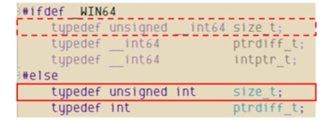

### printf()
- 화면에 데이터 출력시 사용
- f는, formatted의 약자다. 
- 즉 예쁘게 정렬맞춰 출력한다는 뜻이다. 

> const char* name = "BloodyMary";
> 
> printf("Hello, %s\n", name);

- %s라는 서식문자가 문자열이 들어갈 위치를 알려준다. 
- C#보다 훨씬 불친절..
- 정수는 %d

### 주석
/* */만 지원한다! (최소한 C89에선)

### C 개괄
C는 절차적 언어다. 순수하게 절차적 언어로만 사용이 가능하다. 

즉, 데이터보타 프로세스에 중점이 맞춰져있다. 
반드시 나쁜 것도 아니고, 이해하기도 쉽다.

컴퓨터가 작동하는 것을 그대로 따라하는 것이기 때문에, 추상적인 개념인 개체지향보다 논쟁 거리가 따로 없다.

- 클래스도 없고, 함수도 전역함수, 변수도 함수 밖에 선언되어있으면 전역, 안에 선언되어있으면 지역변수.

### C의 자료형
unsigned라는 단어를 자료형 이름 앞에 넣어줘야한다.ex.unsigned char
- signed를 명확히 하기위해 붙여줄 수도 있다. 근데, unsigned/signed를 생략하면 부호 있는게 기본이다. 

- char
  - 최소 8비트인 정수형
  - 웬 최소? 8비트 이상이라고만 정의하는 C..
  - 컴파일러 제멋대로 1백만 비트도 가능하다.
  
그렇다면, 몇 비트인지 찾는 방법
> #include <limits.h>

헤더 인클루드 한 뒤에, CHAR_BIT을 보면 알 수 있다. 

char는 이 기계에서 도는 가장 작은 메모리고, C 표준은 기본 자료형의 정확한 바이트 수를 강요하지 않는다. 
바이트는 char의 크기. 
하드웨어마다 표준이 다를 수 있기 때문에 표준을 명확히 세우지 않았다. 

char에 기본 부호가 지정이 안되어있다. 
부호 여부를 판단하려면? <limits.h> 에서 CHAR_MIN을 보면된다. 

- 근데 왜 signed char가 -128이 아닌가? 
  - 아주 옛날 기계는 1의 보수를 쓸지도 모르기 때문에, 안정적으로 처리
  - 안전한 포팅을 위해

실제로 그러나 개발할 경우 안전히 생각해도 되는 것
1. 크기: 8비트
2. 부호를 생략할 경우: signed

- short
  - 최소 16비트, char의 크기 이상이다.
  - 메모리를 적게 쓰기 위해 사용하지만, int 대신 short 사용하면 성능이 느려질수도. cpu가 신경써줘야해서.

- int
  - 최소 16비트, short 크기 이상!
  - cpu의 레지스터 크기에 맞추고, 그 데이터를 워드 크기라 한다. 워드 크기 = 레지스터 크기
  - 16비트 cpu가 예전에는 흔했다. 그래서 최소 16비트라고 한다. 
  - cpu에게 앞뒤 생략하고 정수 처리하라고 하면 그냥 말을 들었다. 
  - 지금 32비트 컴퓨터가 나와서 int 크기는 32비트가 되었다.
    - 지금은 64비트인데? 그래도 32비트. 
    - 너무 오랫동안 32비트를 int의 크기로 사용해서. 바꾸기 애매하다.
    - 성능이 무조건 빨라지지도 않는다 64비트로 바꿔도.
    
  - 표준은 short와 같다. (포팅의 안전한 범위가)
  - int의 리터럴
    - 리터럴: u, U 모두 가능. 부호 없는 수를 표현

- long
  - 최소 32비트고, int 이상의 크기
    - 최소 64비트인 정수형? C89에는 없다. 
    - 표준에 상관없이 보통 안전하게 생각해도 되는 것: int와 같다. 
  - 리터럴: l을 붙이는 경우가 잇다. ul 로 unsigned+long 의미를 줄 수도 있다. 
    - 없으면 경고가 나온다. 
---

- float
  - 표준에 따르면 IEEE 754일수도 아닐수도.
  - 크기는 char 이상이면 된다. 
  - unsigned 형 없다. 
  - 보통 안전히 생각해도 되는 것은 32비트 된다. 
- double
  - cpu가 계산에 사용하는 기본 데이터 크기
  - 크기는 float 이상이면 된다. 
  - unsigned형 없다. 
  - 표준에 상관없이 안전하게 생각해도 되는 건 64비트
- long double
  - double보다 정밀도가 높다. 
  - double 이상의 크기면 된다. 
  - unsigned형 없다. 
  - 생각보다 잘 안쓴다. 

데스크톱에서는 다른 언어와 비슷하게 사용 가능하다. (예외: long: 32비트) 소형 기기 다룰 때는 자료형 크기 확인 후 사용할 것! 

---
- bool형
  - C89에 없음.
  - 정수로 쓸 수 있다. 0이면 false, 0이 아니면 true
  - 하드웨어에서도 실제 bool은 없다. 
  - 그래서, while문의 조건으로 숫자를 사용 가능하다. 
  - 그런데, 반환할 때 0이면 false라는 것은 다 알지만, 0이 아니면 true인지, 혹은 1이면 true인지를 확실히 정해야한다. 

- enum형
  - 거의 오류를 방지할 수는 없다. (A 열거형을 B 열거형에 대입해도 컴파일 오류가 나지 않는다.)
  - C에서는 별명을 붙이는 수준이라고 생각하면 된다. 
  - 그래서 실수하지 못하게 코딩 표준을 정할 필요가 있다.

### 변수선언
      - 반드시 블럭의 시작에서만 선언해야한다.
    > int main(void)
     {
    > 
    > int num1 = 10;
    > 
    > int num2 = 1234;
    > 
    > int result;
    > 
    > }
    
    각 블록 시작에서 선언만 하고 뒤에 대입한다. (값이 일단은 없더라도)
### 연산자
  - 순위: 대부분 왼 -> 오
  - 그러나, f() + g() * h()는 뭐부터 진행될지를 모른다. 
    - 각 피연산자 값을 평가, 적용해야 되는데, 평가는 순서가 다를 수 있다.
  
- C에서 새로 만나는 연산자
1) sizeof: 피연산자 크기를 byte로 나타낸다. 이 때 꼭 1 바이트는 8비트가 아닐수도 있다. 
> char ch = 'a';
> 
> size_t size_c char = sizeof(ch);

부호없는 정수형의 상수로 size_t형
근데 **size_t**란? 
- 어떤 정수형도 될 수 있다.
  - _t는 typedef라는 것. 다른 데이터형의 별칭이다. 
  - 어떤 것의 크기를 나타내는 데이터형이다. 근데 실제 데이터 형은 아니다. 
  

이렇게, 정의하는 바에 따라 다르다.

- size_t의 크기는, C89에서는 따로 명시하지 않았다. 단 배열을 만들면 그 배열의 바이트 크기를 담을 수 있다고 명시했다. 
  - 그런데, 그럼 배열의 크기가 얼마나 커지는 걸까? 
    - 2^8 -1 은 너무 작고, 최소 2^16-1은 되어야할 것 같다. 다행히도 C99에는 최소 16비트를 요구한다. 
  - 보통은 unsigned int를 사용한다. 배열에 사용되는데, 음수가 있는 signed보다는 두배 더 공간을 차지 가능한 unsigned가 이득.

2. 역참조 연산자
  - int num1 = *p;
  - 포인터형 변수에만 사용 가능
3) 주소 연산자 & 
   - 변수의 위치를 가져오는 연산자. 
   - 메모리의 주소를 반환한다.
4).연산자
     - 클래스가 없어, 함수 호출에선 불가하다.
     - 구조체에서 사용한다
5) -> 연산자
   - .와 *를 합친 것이다. 줄여쓴 것이라 생각하면 된다. 
   - ex) (*s).data = s -> data

---
### 조건문과 반복문
bool형이 없어도 작동할 수 있다. 1 또는 0을 반환한다. 

1) switch
   - switch의 case에는 정수만 들어갈 수 있다. 
   - case문에서 break를 잊으면 안된다. 그렇지 않으면 그냥 다음줄을 실행하게 된다. 
   - 만약 의도적으로 다른 케이스 코드를 실행하고 싶었다면, /* intentional fallthrough */ 주석을 추가해야한다.