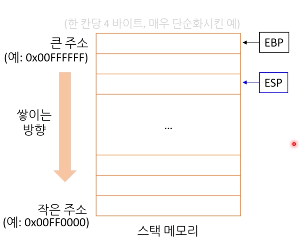

## 범위
1. 블록
  - 중괄호 안
  - 함수 중간에 변수를 선언할 수 있다. 만약 블록을 만든다면!
    - 실수 여지가 줄어들기는 하지만, 그렇게 좋은 코드처럼 보이지 않는 문제가 있다.
2. 파일
   - 전역변수
      - 어떠한 블록이나 매개변수 목록에도 속하지 않고, 파일 내에 있다. 
      - 이 경우, 변수 메모리의 위치는 다른 소스코드 파일 내에서 링크가 가능하다. 
      - 프로그램 실행동안 공간을 차지한다. 
      - 컴파일 될 때 어디에 쓰는지 아니까, **데이터 공간**에 들어간다. 

      - 
3. 함수
   - 함수 안에서 선언된 레이블은 함수 어디에서라도 접근이 가능하다. ex. goto
4. 함수 선언
   - 목록에 있으면, 그 목록 내에서 접근이 가능하다. 

## const 
프로그래머의 실수를 줄인다. 
1. 수정하면 안되는 코드를 수정했을 때, C에서는 매개변수 자체를 const로 처리할 수 있다. 
2. 값변경을 하면 안되는 상수가 있다면, 런타임 중의 변수라도 const 붙일 수 있다. 
- 베스트 프랙티스
  - 모든 변수에 일단 const 붙이고, 
  - 정말 값 변경이 필요시 const를 뺀다
  - 굳이 말하자면, 언어의 기본 동작이 바뀌어야 한다. 
  - ex. rust의 mut
## goto

- 나쁜예: 

> infinity:
>   ...
> goto infinity;

- 일반적인 예
  - 반복문으로 이용될 수도 있다. 어셈블리어에서 상당히 유사하다. 
  - 반복문은 결국 goto를 사용한 코드인데, 그를 쓰지 않는 이유는 안전하게 하기위함이다. 
  - 그러나, 그렇다고 해서 goto를 악마라고 하는 것은 문제다.
- 실제로 악마같긴 하다.
  - 스파게티 코드를 양산한다 
  - 그러나, 항상 그런 악마는 아니다. 
  - 유용한 경우: 
    - 1. 반복문을 3중으로 할 때
    - 2. 조건문이 여러개라 공통된 코드를 실행해야 할 때.
    - 3. 로버트 러브 아저씨의 멋진 방법
        - 중간에 에러가 나면 이미 수행한 작업을 되돌린다.
        - A만 수행했다면 A만 되돌리고,
        - A->B수행했다면, B->A순으로 되돌린다.

- C#에서도 상태머신 case처럼, switch 문에서 사용 가능하다.
- 베스트 프랙티스
  - 절대 goto가 안된다고 하는 회사는 그냥 따를 것..
  - 그게 아니라면, 일단 goto는
    - 아래쪽으로만 jump
    - 2, 3중 포문 탈출시
    - 여러개의 조건문이 공통된 코드 실행시 사용

## 배열
- 다른 언어와는 달리, new를 사용하지 않는다. ex) int nums[5]
- C에는 new 키워드가 없다. 
- 값형으로 배열을 만들 수 있는데, 참조형으로도 만들 수 있는 등 온전히 나의 선택이다.
## 스택메모리
<LIFO> 자료구조의 스택과 작동방법이 동일하다. 

- 각 함수에서 사용하는 지역변수를 임시적으로 저장한다. 
- 프로그램 빌드시 크기가 결정된다.
- 스택 메모리의 위치는 실행시 결정된다. 꼭 힙, 데이터들과 함께 붙어있는 것은 아니다. 
- 함수에서 호출될 때마다 그 함수에서 필요한 공간을 스택에서 떼어줬다가, 그 함수가 반환하면 그냥 흔들어 지워버린다. 
  - 기본 자료형 변수는 사전에 정형화되어있는 스택 메모리에 할당하고, new 없이 사용 가능하다. 
  - 스택 사이에 구멍이 없다. 처음 시작부터 끝까지
  - 배열도 스택 메모리에 들어간다. 
- 레지스터 종류: EBP, ESP
  - EBP: 현 프레임의 기본 주소
  - ESP: 현재 스택 포인터
  
스택 크기는 한정적이다. 이를 따로 정해줄 수는 있다. 
- 정해진 스택 크기 이상을 저장하면 오버플로우가 난다. 
- 너무 큰 데이터를 넣으면 안된다. 그래서 동적 메모리할당이 대안이다. ex.new(C#)
- 재귀 함수 잘못 써도 스택오버플로우가 난다. 

### 배열 크기 알아보기

sizeof: 컴파일 중 배열 크기를 알 수 있다. sizeof(arr) / sizeof(arr[0])

그런데, sizeof(매개변수)는 조금 다르다.
총 배열 바이트수를 반환하려면 배열의 모든 요소가 스택에 복사되어 전달되어야 하고, 호출되는 함수는 스택에 복사된 모든 요소의 크기를 알아야한다.
- 함수의 스택 메모리 사용량은 고정되어있기 때문에, 매개변수에 따라서 배열 크기가 달라지는 것은 안된다.
- 따라서, 배열을 매개변수로 전달할 때는, 실제 모든 요소를 스택에 넣지않고, 그 배열의 시작위치를 스택에 넣어준다. 
  - 또한, 이 주소의 크기는 포인터데이터형의 크기이며, 32비트 플랫폼 > 4, 64비트 > 8바이트다.
  

