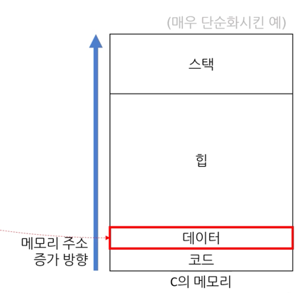
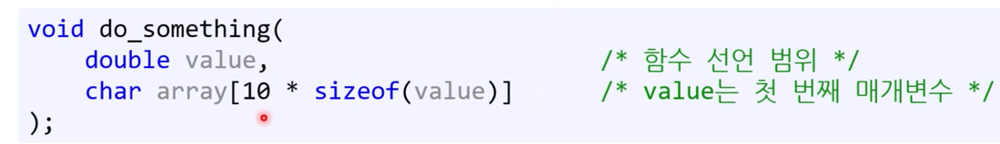
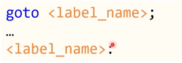
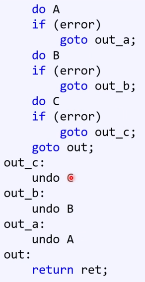

## 범위
1. 블록
  - 중괄호 안
  - 함수 중간에 변수를 선언할 수 있다. 만약 블록을 만든다면!
    - 실수 여지가 줄어들기는 하지만, 그렇게 좋은 코드처럼 보이지 않는 문제가 있다.
2. 파일
   - 전역변수
      - 어떠한 블록이나 매개변수 목록에도 속하지 않고, 파일 내에 있다. 
      - 이 경우, 변수 메모리의 위치는 다른 소스코드 파일 내에서 링크가 가능하다. 
      - 프로그램 실행동안 공간을 차지한다. 
      - 컴파일 될 때 어디에 쓰는지 아니까, **데이터 공간**에 들어간다. 

      - 
3. 함수
   - 함수 안에서 선언된 레이블은 함수 어디에서라도 접근이 가능하다. ex. goto
4. 함수 선언
   - 목록에 있으면, 그 목록 내에서 접근이 가능하다. 

## const 
프로그래머의 실수를 줄인다. 
1. 수정하면 안되는 코드를 수정했을 때, C에서는 매개변수 자체를 const로 처리할 수 있다. 
2. 값변경을 하면 안되는 상수가 있다면, 런타임 중의 변수라도 const 붙일 수 있다. 
- 베스트 프랙티스
  - 모든 변수에 일단 const 붙이고, 
  - 정말 값 변경이 필요시 const를 뺀다
  - 굳이 말하자면, 언어의 기본 동작이 바뀌어야 한다. 
  - ex. rust의 mut
## goto

- 나쁜예: 

> infinity:
>   ...
> goto infinity;

- 일반적인 예
  - 반복문으로 이용될 수도 있다. 어셈블리어에서 상당히 유사하다. 
  - 반복문은 결국 goto를 사용한 코드인데, 그를 쓰지 않는 이유는 안전하게 하기위함이다. 
  - 그러나, 그렇다고 해서 goto를 악마라고 하는 것은 문제다.
- 실제로 악마같긴 하다.
  - 스파게티 코드를 양산한다 
  - 그러나, 항상 그런 악마는 아니다. 
  - 유용한 경우: 
    - 1. 반복문을 3중으로 할 때
    - 2. 조건문이 여러개라 공통된 코드를 실행해야 할 때.
    - 3. 로버트 러브 아저씨의 멋진 방법
        - 중간에 에러가 나면 이미 수행한 작업을 되돌린다.
        - A만 수행했다면 A만 되돌리고,
        - A->B수행했다면, B->A순으로 되돌린다.

- C#에서도 상태머신 case처럼, switch 문에서 사용 가능하다.
- 베스트 프랙티스
  - 절대 goto가 안된다고 하는 회사는 그냥 따를 것..
  - 그게 아니라면, 일단 goto는
    - 아래쪽으로만 jump
    - 2, 3중 포문 탈출시
    - 여러개의 조건문이 공통된 코드 실행시 사용