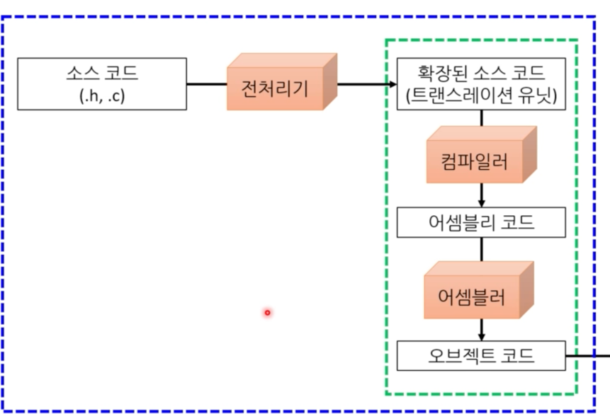
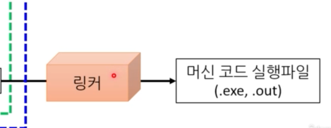
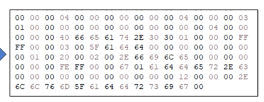

## 범위
1. 블록
  - 중괄호 안
  - 함수 중간에 변수를 선언할 수 있다. 만약 블록을 만든다면!
    - 실수 여지가 줄어들기는 하지만, 그렇게 좋은 코드처럼 보이지 않는 문제가 있다.
2. 파일
   - 전역변수
      - 어떠한 블록이나 매개변수 목록에도 속하지 않고, 파일 내에 있다. 
      - 이 경우, 변수 메모리의 위치는 다른 소스코드 파일 내에서 링크가 가능하다. 
      - 프로그램 실행동안 공간을 차지한다. 
      - 컴파일 될 때 어디에 쓰는지 아니까, **데이터 공간**에 들어간다. 

      - 
3. 함수
   - 함수 안에서 선언된 레이블은 함수 어디에서라도 접근이 가능하다. ex. goto
4. 함수 선언
   - 목록에 있으면, 그 목록 내에서 접근이 가능하다. 

## const 
프로그래머의 실수를 줄인다. 
1. 수정하면 안되는 코드를 수정했을 때, C에서는 매개변수 자체를 const로 처리할 수 있다. 
2. 값변경을 하면 안되는 상수가 있다면, 런타임 중의 변수라도 const 붙일 수 있다. 
- 베스트 프랙티스
  - 모든 변수에 일단 const 붙이고, 
  - 정말 값 변경이 필요시 const를 뺀다
  - 굳이 말하자면, 언어의 기본 동작이 바뀌어야 한다. 
  - ex. rust의 mut
## goto

- 나쁜예: 

> infinity:
>   ...
> goto infinity;

- 일반적인 예
  - 반복문으로 이용될 수도 있다. 어셈블리어에서 상당히 유사하다. 
  - 반복문은 결국 goto를 사용한 코드인데, 그를 쓰지 않는 이유는 안전하게 하기위함이다. 
  - 그러나, 그렇다고 해서 goto를 악마라고 하는 것은 문제다.
- 실제로 악마같긴 하다.
  - 스파게티 코드를 양산한다 
  - 그러나, 항상 그런 악마는 아니다. 
  - 유용한 경우: 
    - 1. 반복문을 3중으로 할 때
    - 2. 조건문이 여러개라 공통된 코드를 실행해야 할 때.
    - 3. 로버트 러브 아저씨의 멋진 방법
        - 중간에 에러가 나면 이미 수행한 작업을 되돌린다.
        - A만 수행했다면 A만 되돌리고,
        - A->B수행했다면, B->A순으로 되돌린다.

- C#에서도 상태머신 case처럼, switch 문에서 사용 가능하다.
- 베스트 프랙티스
  - 절대 goto가 안된다고 하는 회사는 그냥 따를 것..
  - 그게 아니라면, 일단 goto는
    - 아래쪽으로만 jump
    - 2, 3중 포문 탈출시
    - 여러개의 조건문이 공통된 코드 실행시 사용

## 배열
- 다른 언어와는 달리, new를 사용하지 않는다. ex) int nums[5]
- C에는 new 키워드가 없다. 
- 값형으로 배열을 만들 수 있는데, 참조형으로도 만들 수 있는 등 온전히 나의 선택이다.
## 스택메모리
LIFO 자료구조의 스택과 작동방법이 동일하다. 
  

- 각 함수에서 사용하는 지역변수를 임시적으로 저장한다. 
- 프로그램 빌드시 크기가 결정된다.
- 스택 메모리의 위치는 실행시 결정된다. 꼭 힙, 데이터들과 함께 붙어있는 것은 아니다. 
- 함수에서 호출될 때마다 그 함수에서 필요한 공간을 스택에서 떼어줬다가, 그 함수가 반환하면 그냥 흔들어 지워버린다. 
  - 기본 자료형 변수는 사전에 정형화되어있는 스택 메모리에 할당하고, new 없이 사용 가능하다. 
  - 스택 사이에 구멍이 없다. 처음 시작부터 끝까지
  - 배열도 스택 메모리에 들어간다. 
- 레지스터 종류: EBP, ESP
  - EBP: 현 프레임의 기본 주소
  - ESP: 현재 스택 포인터
    
스택 크기는 한정적이다. 이를 따로 정해줄 수는 있다. 
- 정해진 스택 크기 이상을 저장하면 오버플로우가 난다. 
- 너무 큰 데이터를 넣으면 안된다. 그래서 동적 메모리할당이 대안이다. ex.new(C#)
- 재귀 함수 잘못 써도 스택오버플로우가 난다.

sizeof: 컴파일 중 배열 크기를 알 수 있다. sizeof(arr) / sizeof(arr[0])

그런데, sizeof(매개변수)는 조금 다르다.
총 배열 바이트수를 반환하려면 배열의 모든 요소가 스택에 복사되어 전달되어야 하고, 호출되는 함수는 스택에 복사된 모든 요소의 크기를 알아야한다.
- 함수의 스택 메모리 사용량은 고정되어있기 때문에, 매개변수에 따라서 배열 크기가 달라지는 것은 안된다.
- 따라서, 배열을 매개변수로 전달할 때는, 실제 모든 요소를 스택에 넣지않고, 그 배열의 시작위치를 스택에 넣어준다. 
  - 또한, 이 주소의 크기는 포인터데이터형의 크기이며, 32비트 플랫폼 > 4, 64비트 > 8바이트다.
  - nums[5]라고 길이가 5인 배열을 넣는 게 아니다. 그냥 프로그래머의 편의, 문서적으로 알려주는 것이다. 
    - 컴파일하면 nums[]와 동일하게 컴파일되기 때문이다. 
  - 매개변수로 배열을 전달하면 **원본 배열이 바뀐다.**
  - 매개변수 배열 길이를 알 방법은 없다. 그냥 size_t n, int nums[]로 매개변수를 전달해주는 편이 안전하다.
  - 

### 배열 요소의 초기값
- 배열 요소 초기화 해주지 않는 C
- 그래서, 그 전에 그 메모리에 있던 값을 그대로 사용한다. 
- 제일 좋은 것은 그냥 int nums[10]={0,};
  - 쉼표를 찍어 뒤에 것이 있다는 것을 암시
- 이렇게 지역변수가 초기화가 되지 않은 상태에서 사용할 수 있다.
- 더불어, 버퍼 오버플로우가 가능하다. 소유하지 않은 메모리에 작성할 수 있다. 즉 다른 변수 공간에 덮어쓸 수가 있다. memory stomp 가능

### 다차원 배열
- 메모리에서 일차원배열과 다른 것은 없다. 
> int table[2][3] = int buffer[2*3]

실제 2차원배열이 메모리에 들어갈 때 일차원과 동일하다. 

## 소스코드에서 실행 파일까지
-> 어떻게 코드가 되는지에 대하여 과정을 알게되면 전체적으로 이해하기가 쉬워진다. 
C에서 컴파일한 모델이, 다른 언어에도 이어졌다. 

## 빌드
빌드란, 사람의 코드를 기계어로 변환하는 과정이다. 
1) 전처리
2) 컴파일
3) 어셈블
4) 링크

여기서 1,2,3을 묶어 컴파일이라고도 하고, 
일반적으로는 2, 3을 묶어 컴파일이라고 한다. 
> clang -std=c890 -W -Wall~

모든 단계를 실행해주는 명령어다. 
여기서 컴파일과 링커를 나누기도 한다.
### .h와 .C가 분리되는 이유
어떻게든 컴파일 방법을 찾아야했다. 
- 실제 프로그램이 돌게 하는 조직: .c
  - 코드를 저장해두는 파일이다.
  - 함수 정의와 구현
  - 전역변수
- 여러 소스코드 파일에 공통적으로 필요한 것들을 저장해두는 파일: .h
  - 함수 선언
  - 매크로
  - extern 변수 선언
- 사용례: 어떤 함수를 쓰고싶으면 함수의 원형을 알아야한다. -> 헤더 파일이 필요해서 .h 파일을 가져다 쓴다. 
- 헤더 파일이 필요한 이유
  - 효율적 구조 (파일 분리, c와 h 분리를 컴파일 때문에 해야했다.)
  - 관리를 제대로 하고싶었다. 
    - 동일한 함수를 여러 곳에서 사용하면 코드가 복붙되고 버그가 가능하다.
    - 헤더 파일로 함수 선언을 하여 여러 c 파일들과 공유한다.
- Q. 그런데, 함수 선언만 가지고 어떻게 프로그램이 가능한지? 
  - 빌드를 쪼갠 이유: 선언만으로 가능하게 하려고.
### include<>와 include""
1) include<>
   - 시스템 경로에서만 검색
   - 컴파일러가 제공하는 세스템 헤더 파일 인클루드
   - 혹은 C언어가 제공하는 시스템 헤더 파일 인클루드
2) include""
   - 현재 작업 중인 디렉털리에서 헤더파일 검색. 없으면 시스템 경로
   - 개발자가 구현한 헤더파일을 인클루드할 때 사용

### 전처리 단계
> 소스코드 -> 전처리 -> 트랜슬레이션 유닛
- 입력: c 파일 하나
- 주석제거
- 매크로 복붙 (확장)
- 인클루드 파일을 확장 (복붙)
  - 헤더 파일
  - c도 할 수 있지만 대부분 잘못됨.
- 출력: 확장된 소스코드
- 트랜슬레이션 unit 보는법
- 컴파일 중에 볼 수 있다. 
- > clang -E 플래그
> clang -E >adder.pre 로 파일로 저장도 가능하다. 

### 컴파일 단계
> 유닛 -> 컴파일러 -> 어셈블리 코드

입력: 트랜슬레이션 유닛

출력: 어셈블리어 코드 
- 어셈블리어는 기계 코드와 거의 1:1로 대응
  - 여전히 텍스트 파일이라, 사람이 읽기가 쉽다. 
- ㅊ어셈블리어는 아직 정의를 모르는 심볼을 사용 가능하다. 
  - 이를 통해 헤더를 통한 선언만으로 컴파일이 가능한 것이다. 어쩌면 약간 떠넘기는 것일지도.
- 어셈블리어 코드 보는 법
- > clang -S 
  s파일로 저장해준다. 

- 어셈블리어 코드가 나왓다는 것은 그 코드가 특정 플랫폼에서만 동작한다는 것이다. 
  - C가 크로스 플랫폼이라는 주장은 컴파일 되기 전까지만 유효하다. 
  - 타겟 플랫폼에 따라 자료형 크기가 달라진다. 

### 어셈블단계
> 어셈블러 코드 -> 어셈블 -> 오브젝트 코드
- 입력: 어셈블리어 코드
- 출력: 오브젝트코드

- 오브젝트 코드 
  - 기계가 곧바로 이해 가능한 코드.
  - 기계어라 한다. (이진 코드)
    - 여전히 메꿔야 하는 구멍이 있다.
- 오브젝트 코드 보는 법
- > clang -c
  - .o 파일로 저장한다. 
  - 일반 텍스트 파일로 보면 보이지 않는다. 
### 링크단계 
- 링커가 담당
- 입력: 모든 오브젝트 코드
  - 하나로 합치고, 구멍을 메꾼다. 
  - 어떻게? 레이블을 기억한다 
    - 함수 호출하면 바꿔준다. 
  - 근데 링커도 링크할 함수를 못 찾으면? 
    - 프로그램 돌리는 의미가 없어서, 링커 오류를 뱉는다. 
- 출력: .exe
- 링크 단계를 분리하는 이유? 
  - 선언만 해둔 라벨들을 합치는 작업을 한다.
  - 실제로 .o 파일을 합쳐서 .exe 파일을 만드는 게 흔한 방식

---
### 라이브러리로도 빌드 가능하다.
실행되는 파일은 아니고, 함수들을 기계어로 변환 후 파일 하나로 저장해둔 것이다. 
나중에 다른 .c파일에서 이 기능이 필요하면, 같이 링크해서 쓸 수 있다. 

- 종류
  - 정적
    - .exe 만들 때 라이브러리 같이 복사
    - 실행속도가 오르고 메모리도 오른다. 
    - 재활용성이 장점이다. 
  - 동적
    - 여전히 실행파일에 구멍이 있고, 실행 파일을 실행할 때 링킹이 일어난다. 
    - 실행 중에 운영체제가 링크해준다.
    - C# 등에서 dll 파일
      - 실행 파일 크기는 작고
      - 여러 실행파일이 동일한 라이브러리를 공유 가능해 메모리가 절약된다. 
      - 문제는 실행파일이 이름은 같이만 다른 동적 라이브러리 사용시 dll 지옥에 갇힌다 ex) 버전이 다른 경우

### 다른 파일의 전역변수 사용시 문제점

컴파일러는 모든 .c파일을 따로따로 컴파일하게된다.
어디ㄱ다 가져다 쓴다고 말해줘야하기 때문에, extern 키워드가 있다. 
.h파일에 적어준다. 

- Q. extern 사용하려면 굳이 .c 파일을 찾아서 전역변수를 확인하고 extern 사용해야하는지?
  - 어떤 경우에는 .c 파일을 볼 수 없을 수가 있다. 남의 라이브러리는 라이브러리 파일 혹은 헤더만 주곤 하기 때문이다. 이 때 헤더에 extern sjgdjwnsek. 
  - .c파일에 extern을 넣을수도 있다. 
    - 헤더에넣으면 누구나 쓸 수 있는 것
    - c파일에 넣으면 그 파일 안에서만 쓸 수 있다. 

- 함수는 extern이 불필요하다. 사용할 곳에서 호출 하기 전에 원형이 선언된다. 
  - 헤더 파일에 넣는다. 
- 전역 변수의 문제는 extern을 사용하면 누구나 값을 바꿀 수 있는 게 문제다. 
  - 다른 파일에서 못쓰게 하려면, 전역 변수를 만들 때 static 키워드를 붙여야한다. 
  - 그러면 링크가 안되어서 다른 파일에서 접근이 불가하다. 
  - 흔히 정적변수라고 불리고
  - 여전히 실행 중에 공간은 차지한다. 
  - Q. 지역 변수에도 static? 
    - static이 붙으면 개념상 전역변수인데, 함수 안에서만 접근이 가능하게 된다. 
    - 함수가 반환해도 값은 저장되어있다. private과 비슷하다.
  - Q. 함수는? 
    - 그 파일에서만 쓰려는 함수는 static 넣으면 외부로부터 접근이 막힌다. 
    - 헤더파일에 들어가지 않는다. 의미가 없기 때문이다. 

### 인클루드 가드
- include끼리 cycle이 있을수도 있다. 
- 이는 인클루드를 .c에서만 해서 해결 가능하지만
- 어쩔 수 없이 서로를 참조해야하는 일이 생길 때 사용한다. 

`#ifndef FOO_H` 만약 FOO_H 정의가 안되었다면 

`#define FOO_H`정의한다.

`원 헤더파일 등장`

`#endif` ifndef 블록의 끝
- #은 전처리기 지시문!
- 어떠한 상수를 정의하고, 컴파일러에 조건적으로 코드 컴파일을 지시한다.

---
### C 컴파일로 종류 및 특징
- 어느 한 회사가 만든 게 아니라서 다양한 컴파일러가 잇고 표준도 깔끔하다. 
- 가장 유명한 것은 GCC
- 다음으로는 마이크로소프트 visual C++ 윈도우에서 많이 쓴다. 
- clang LLVM컴파일러 구조를 사용하는 C계열 언어 컴파일러다. gcc에서 많이 넘어왔다.
