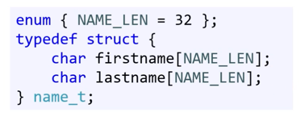

## 필요성
- C에서 모든 data는 값형, 주소만 전달하면 참조형처럼 쓸 수 있다. 
  - 주소 전달 안되면 값형
- 사람들은 세상을 덩어리로 파악하고
- 실수도 막을 수 있다. 
- 원자성을 보장하는 연산을 사용하는 게 좋다. 

### 구조체
```c
struct date{
  int year;
  int month;
  int day;
};
```

> struct date date;

여기서 앞의 date는 구조체명, 뒤의 date는 변수명이다. 

- 구조체는 함수의 매개변수로도 사용이 가능하다. 
- 조금 더 **간결하게** 구조체를 정의할 수 있다. 
  - typedef 추가시 이미 있는 struct라는 자료형에 새로운 별명을 지어주게 된다.
  - 저 위에 있는 date라는 구조체를 가져와서 date_t라는 별명으로 변수 선언을 할 수 있게 된다.
  - > typedef struct date date_t;
  - > date_t date; 로 사용
  
- 애초에
```c
typedef struct date{
int year;
int month;
int day;
}date_t;
```
```c 이게 편함! 
typedef struct {
int year;
int month;
int day;
}date_t;
```

위의 두 방식으로도 사용 가능하다. 

_t라고 자료형이 끝나면 이렇게 typedef 한 것.
- 열거형도 똑같이 작성할 수 있다. 

---
### 구조체 변수 초기화하기
- 하드웨어는 구조체라는 것을 모른다. 
- 즉 구조체는 각 지역변수를 따로따로 사용하는 거랑 마찬가지다.
- 그래서 꼭 초기화를 해주어야한다. 아니면 기존 스택 메모리 가져온다.

date.year = 0...도 가능하고
date_t date = { 0, } 도 가능하다.
- 컴파일러에 따라 memset() 같은 것으로 모든 메모리 공간을 0으로 채워주는 명령어로 바꿔볼 수도 있다.

- 아예 요소나열법을 통해서도 date_t date = {1,2,3} 가능하지만, 이 경우 누군가가 구조 바꾸었다면 반영이 힘들다. 
  - 이를 유용하게 쓰려면 구조체 내부의 멤버 변수를 const로 선언해주는 것. 근데 쓰지 않는 게 업계 표준.

### 구조체 매개변수
구조체는 값형 ! 

구조체를 인자로 전달할 때, 이는 값형으로 전달하는 것이다. 원본을 바꾸려면 주소 전달을 해야한다. 
```c
date_t* date로 전달받으면
(*date).year = (*date).year+1; 혹은
date->year = date-> year+1;
```

- 구조체의 경우 멤버변수 너무 많을 때, 주소로 전달하는 게 공간이 훨씬 덜 나온다. 
- 포인터에 const 넣으면 원본 변경이 안된다. 
- 매개변수를 구조체로 전달하는 것과 개별 매개변수로 전달하는 것 중 선택하는 데에 정확한 기준은 없지만 보통은 구조체로 전달한다. 
  - 4개까지는 그냥 낱개변수로 하라는 회사도 있다. 그 이상되면 실수가 많아질 수도 있으니

---
### 함수 반환값
- 복사에 의한 반환이다.
- 하나씩 대입도 된다. memcpy() 사용시 메모리 통째로 복사해준다.
- 구조체로 배열도 만들 수 있다. 컴파일러는 그 크기를 이미 알고잇다.

### 얕은 복사 , 깊은 복사
- 포인터만 복사하는 것: **얕은 복사**
- 깊은 복사: 대입만으로는 안되고 동적 메모리 할당 필요

### 포인터 저장의 문제
파일로 저장할 때 포인터를 저장하고 프로그램을 종료하게 되면, 주소만 저장하는 것이기 떄문에 다음 컴파일시 주소가 바뀌게 되고 결국 원하는 데이터를 읽을 수가 없다.
따라서,
구조체 내의 데이터는 포인터가 없는 게 좋다. 대입, 저장할 때! 
- 구조체 내에 배열을 저장하면 내용 전체 복사도 가능하다. 

아래와 같이 char pointer가 아닌 char 배열로 ! 

## 구조체를 다른 구조체의 멤버로 사용
- 시스템마다 메모리에 접근할 때, 사용하는 주소에 대한 요구사항이 다르다. 
  - 시스템 상의 제약
  - 효율성 두가지 이유 때문
- x86 시스템은 4바이트(워드 크기) 경계에서 읽어오는 게 효율적이다
  - 4바이트 경계에 정렬된다. 
  - 안 쓰는 바이트를 덧붙였다.
  - 따라서 어떤 아키텍처에서 저장한 파일을 다른 아키텍처에서 읽으면 잘못 읽힐수도 있다. 

### 베스트 프랙티스
- 바이트 크기가 정확히 맞아야한다면 assert()로 확인할 것
- 어쩔수없이 패딩이 생길거라면 구조체에 패딩을 명시적으로 넣기도 한다. 

이 패딩이 생기는 것을 지양해야한다. 아키텍쳐마다 다르게 해석하면 다른 내용이 읽힐 수도 있기 때문이다. 

### 바이트 정렬
`unsigned short height;
float weight;
unsigned short age;`

와
`unsigned short height;
unsigned short age;
float weight;
`
은 서로 크기가 다르다. 위의 것이 크기가 더 크다. 그 이유는 패딩 때문이다. 
#pragma pack을 통하여, 패킹을 해줄 수는 잇지만, 잘 못 쓴다. 
- 어쩔 수 없이 패딩이 생길거라면 구조체에 패딩을 명시적으로 넣는 방법도 있다. (워드 크기 맞추기 위해)

## 비트 필드
```c
typedef struct {
  unsigned char b0:1;
  ...
}bitflags_t;
```

- 구조체로 크기를 자유자재로 조정 할 수 있다. (비트 플래그라 볼 수 있음)
- 해당 구조체의 내부는 비트로 쪼개진 것이다. 
- 그러나 전체를 한번에 체크하기란 어렵다. 포인터로 할 수는 있지만 실수할 가능성이 높다. 이를 해결하기 위해 공용체를 사용해볼 수 있다.

## 공용체
구조체와 비슷하지만 구조체 내의 변수를 서로 다르게 해석하고 싶을 때 사용한다. 
```c
typedef union{
  unsigned char val;
  struct {
    unsigned char b0:1;
    ,,,
  }bits
}bitflags_t;
```

위의 val과 bits는 같은 공간을 공유한다. 동일한 메모리를 두개의 다른 자료형으로 접근하는 것이고, 메모리 값은 동일하다. 
- 메모리 공유만을 위한 공용체는, 실수가 생길 수도 있고, 덜 유용하다. 

