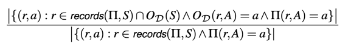

## 12/27

## Abstract
불명확한 구조 데이터로 가득한 웹을 DIADEM이 자동화로 높은 정확도의 구조데이터를 추출할 수 있게 했다.
97%의 평균 정확도로 모든 관련 데이터를 추출해낸다. 더불어 노이지한 엔티티도 견딘다. 

## Introduction
사람에 의해 만들어진 HTML 페이지를 추출하는 것은 기나긴 도전이다.
반 정도 감독 하에 데이터 추출하는 시도는 굉장히 확장적으로 조사되었으나, 사용자가 감시를 해야한다.
반면에 완전한 자동화 (AFE)는 높은 구조화 데이터만 추출할 수 있었다.

사이트 전체 추출 자동화는 **세가지 메인 문제**가 있는데, 하나는 사이트 exploration, 레코딩, wrapper induction이다.
이 각각도 문제지만, 더 안 좋은 것은, 이 문제는 몇몇 예외와 함께 고립을 초래한다는 것이다.

AFE는 간단한 구조에만 작동하게끔 국한되었다.
이렇게 기술이 뒷받침하지 못하여 데이터 추출 임팩트를 현저히 줄어들게했다.

DIADEM은 첫 사이트 전체 추출 자동화 시스템이다. 이전의 AFE와는 다르게 정확도가 몹시 높다. 하나 혹은 두개의 문제 해결에 집중하던 AFE와는 다르게, 
모든 문제를 해결한다. 감독도 요구되지 않는다.

DIADEM은 1) 세가지 메인 문제를 해결하였다. 2) 이 세가지 문제를 결합해 더 다양한 범위의 사이트를 대응하게 하였다.

극복해야할 문제는 1) 도메인 지식이었다. 도메인은 스키마를 포함할 뿐만 아니라 웹사이트 외적으로 이를 분류하고 제한한다.
2) 자가 적응 관계 네트워크 변환기로서 인식되는 것이다. 네트워크는 이전에 쌓은 지식을 기반으로 적응하는데, 좀더 확장성있기 위하여, 접근 정책을 강화했다.

# 1-1 예시
DIADEM은 URL이 주어졌을 때, form 엘리먼트가 전체를 감싸고 있음에도 불구하고, 두 개의 버튼을 구별해낸다. DIADEM이 엔티티 인식을 하며, 텍스트 필드의 예시 값을 가져온다.
따라서, 그를 잘 분류해낸다. 폼 엘리먼트에서 필수인 것을 발견해내고 구별해낸다.

도메인-인식 템플릿을 통하여 미리 가격을 포함하고 있을 것을 예지한다.
DIADEM은 파악한 레코드와 네비게이션 경로를 통하여 wrapper를 만든다.
이를 통하여, 모든 프로퍼티를 추출해낸다. 

# 2 문제 언급
DIADEM은 대규모로 전체 웹사이트의 데이터를 자동으로 추출해낸다.
- D : 타겟 도메인
- S: 웹사이트
- Σ : 속성값 세트
- O_D: D에서 추출해내는 방법
- Π: wrapper, S와 D의 전체 사이트 래퍼

- 정의 1: OD(S) = set(records(Π,S))이면, A ∈ Σ이고 OD(r,A) != NULL이면  Π(r`,A) != NULL을 말한다. 

대충 말해서, 래퍼는 Π와 O_D가 같은 레코드를 추철하였을 때 효과적이다. 
효과는 실제 exploration에는 영향을 받지 않는다. 이는 래퍼로 하여금 가장 효율적인 경로나 가장 적은 쿼리양을 요구하지 않는다.

- 정의 2: S가 웹사이트고, Σ가 속성값 세트일 때, 속성 품질은 아래와 같다.

모든 연관된 레코드가 추출되기를 요구하는 경우, 속성 품질은 추출된 값의 정확도를 측정한다. 

- 정의 3: S가 웹사이트고, Σ가 속성값 세트일 때, 자동 사이트 추출 문제는 Π를 찾아내는 것이다. Π는 효과적이고, 속성 품질이 최대여야한다.

# DIADEM ONTOLOGY
규정된 도메인과 상황 지식은 DIADEM이 높은 정확도와 효과적인 래퍼를 만들게한다.
이는 아래의 튜플이다.
- 스코프: 뷰를 제공한다. 
- 타입: 현상학적 타입을 구별한다. 
- 관계 프로퍼티
- 밸류 프로퍼티: 타입을 데이터 타입 값과 연관
- 데이터 타입 값

관계 속성 중에서 유형에 대한 표준 관계 세트를 구별한다. subTypeOf 과 partOf은 계층을 정의한다.
instanceOf은 현상학적인 타입에서 구체적인 타입으로 나온 단 하나의 릴레이션이다. 이런것들이 20개는 넘게 있다. 

### 라벨링된 엔티티 인식기
DIADEM은 인스턴스와 라벨을 인식한다. 기존 이름만 인식하는 인식기는 
DBPedia와 같은 지식에 기반한다.
엔티티가 좀 모호할 수 있기에, 이 이름 인식기는 종종 충분하지 않을 때가 있다. 이를 해결하기 위해, 
DIADEM은 라벨링된 이름 인식기이다. html, css를 이용한다. 주위 마크업을 이용한다. 

# 접근
관계적 변환은 DIADEM의 기본 컴포넌트를 이룬다. 
변환기끼리의 통신과, 결합을 제공한다. 
1) 고립: 변환기는 변환된 메모리로만 통신하고 서로에 대해서는 모른다.
2) 재개 가능: 변환기는 반복적으로 실행되어, 미뤄진 컴퓨팅을 지속한다.
3) 복잡성: 변환기는 일반적으로 통제된 값을 이용하는 복잡한 Datalog 프로그램이다. 
4) 데이터 파티셔닝: 세밀한 변환기 범위로 엄격하게 분할되었다.

## 관계 변환기
스코프와 의존성은 DIADEM에서 고립을 확실히 하고, 공유된 메모리를 관리하고, 동적으로 통제 플로우를 결정하기위해 사용된다.

스코프를 변환기는 파악하고, 의존한다. 이 의존은 변환기 각각의 인풋 사이즈를 줄인다. 

재개가 가능하다. 모노톤이라 추가적인 호출은 추가 아웃풋을 내나, 이전 사실을 다시 추출하지는 앟는다. 

DIADEM에서 관계 변환기는 세 가지의 타입으로 등장한다.
1) 상태 없는 현상학적 변환기. 도메인에 독립적, 가능한 도메인 의존적 현상지식을 쿼리함. 인풋 드리븐 재개방식.
2) 상태있는 한정 상태 변환기는 트랜지션이 첫번째 순서 포뮬라에 의해 지켜질 때 인코딩한다. 폼 filling이 그 예다.
3) interaction with the browser 이나 높은 퍼포먼스를 위해 외부 프로그램이 필요하다. 

## 동기화된 변환기 네트워크
인풋과 아웃풋을 다루는 공통 메모리를 사용하는 변환기 세트다.
네트워크는 적응을 스스로 한다.
- M은 아웃풋 릴레이션의 스키마
- ctl은 개별 변환기와 통제 변환기 Ctl사이를 통신하는 데 사용
- 이미 실행 중비중인 변환기가 있다면, 통제 플로우는 우선순위에 의해 결정된다. 

이미 방문한 사이트나 페이지에 의해서 의존과 가드 규칙이 결정된다.
이런 변환기는 특정 상위 변환기나 가드룰을 만족해야한다. 

요소를 선택할 때는 병렬로 실행될 수는 없어서, 그때는 순차적으로 접근한다.

뒤를 탐색하는 것은 다양한 대체 경로를 요구하기에 중요하다. 
어떤 관련된 데이터가 찾아올지 DIADEM은 알 수 없다..

변환기가 재시작할 수 있고 뻗지 않았을 때까지 시스템은 뒤로 돌리게 되거나, 아직 실행되지 않은 몇몇 변환기가 있을 때 우선순위 선택일 때까지 뒤로 돌린다.

변환기 네트워크는 우리가 정해진 페이지를 탐색하거나 순환고리를 피하면 항상 종료한다.

## 평가
1) 데이터셋의 특징
2) 만들어진 래퍼의 효과성과 추출된 속성 품질
3) 도메인 지식 영향
4) 변환기와 추출의 네트워크 퍼포먼스를 평가한다.

일단 Diadem은
1) Url을 주면 95%이상의 경우 10분안에 래퍼를 만들어낸다.
2) 현재 있는 타 솔루션보다 월등히 좋다.
3) 래퍼는 90만개 이상의 레코드를 공급한다.
4) 이 모두를 하기위해 84억의 자료들, 212기가의 데이터를 제공한다.

### 인프라
하둡에서 만들어졌다. 
10기가까지 메모리 허용을 해두었다.

### 데이터셋
DIADEM을 5개의 데이터셋 도메인에 적용한다.
많은 수의 사람들이 이용하고 활동적인 도메인을 선택하였다.

### 품질
1) 래퍼 효과성, 사이트와 래퍼 유사성 비율
2) 속성 품질, 정확한지
3) 폼 라벨링 정확도 
4) 레코드와 속성 분별 정확도

주된 결과는 90% 넘게 각 데이터셋에서 래퍼가 효과적이고, 91%가 평균 효과성이었다.
두 단계를 거쳐 이를 확인했다. 
각각의 래퍼를 한 사람이 수동으로 확인했다. 만약 래퍼가 효과있다면, 자동으로 검색결과 숫자와 비교된다.
만약 그 숫자가 없으면, url과 이미지가 하나씩 있는 것을 사용한다.

DIADEM이 효과없는 경우는, 다양한 피봇 속성이있거나 드문 선택속성이 있을 때다. 
이러한 사이트들에서, DIADEM은 효과적인 래퍼가 없음을 파악한다.

DIADEM은 타겟 도메인이 아닌 것은 래퍼를 만들지않는다. 

---

속성 품질을 파악하기위해 수동으로 이를 검사했다. 
라벨링 정확도를 검사하기위해 ICQ 벤치마크에서 비교했다. 
레코드와 속성 분별 정확도를 검사하기위해, 다른 것들과 비교했는데, 월등히 DIADEM이 좋았다.

### 도메인 지식
새로운 도메인마다 40-60개의 새로운 타입이 있다. 
도메인이 연관되면 새로운 타입은 5-10개다. 
사실 온톨로지 자체보다 이런 타입들이 중요하다.

### 퍼포먼스
대부분 래퍼는 10분안에 나온다.
퍼포먼스는 이미 방문한 페이지 수, 크기, 폼 필링 수와 관련돼있다.
변환기의 시간에 영향을 주는 것은 브라우저 인터랙션, 페이지 렌더링 등이다. 

## 관련 연구
풀 사이트 추출은 추출된 엔티티의 타입에 따라 제한을 둔다. 
더 커질수록 더 제한적이다.

### 탐색
크롤링과 자동 폼필링을 통해 이루어진다.
도메인 모델은 적절한 구조와 행동을 제한하게한다.

### 레코드와 속성 분별
현대 웹사이트는 데이터가 아닌 내용들을 많이 쓰는 구조를 택한다. 
이런 문제는 자동화가 아니라 감독적인 접근이 피료하다.
여기에는 상황적인 접근이 필요하다. 그를 통해서 관련없는 구조는 뺄 수 있어야한다. 

### 래퍼 생성
이미 정확도같은 것은 증명되었지만, 여전히 사소하지않은 기능과 다른 트레이닝 샘플이 필요하다.

## 결론
DIADEM은 전체 사이트 추출 자동화하는 첫 시스템이다.
그렇지만, 여러 이슈들이 있다.
1) 대부분의 도메인에 적절히 적용될 수 있지만, 이벤트성 도메인은 어려울 것 같다.
2) 때때로, 리스팅 페이지는 가능한 데이터의 섭셋만들 보여주고 모든 데이터 추출은 개별 디테일 페이지를 방문하는 것을 요구한다.
디테일 페이지로부터 추출한 것은 사이트마다 달라서 자동으로 양을 재어야한다.
3) 효과적이나, 폼 인터랙션은 가장 어려운 문제다. 동적인 필드 의존성을 이해하고 더 복잡한 위젯과 관련해서는 더욱 그렇다.

