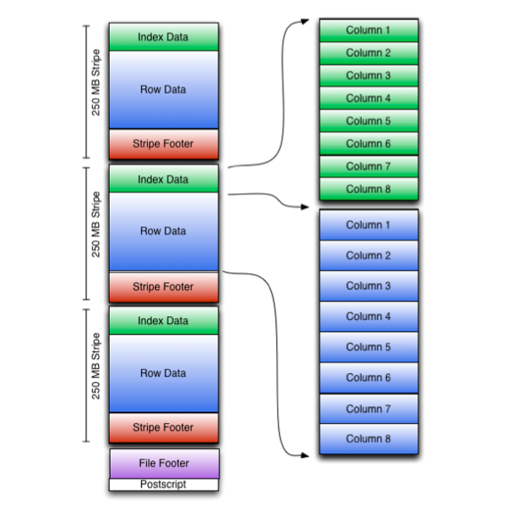
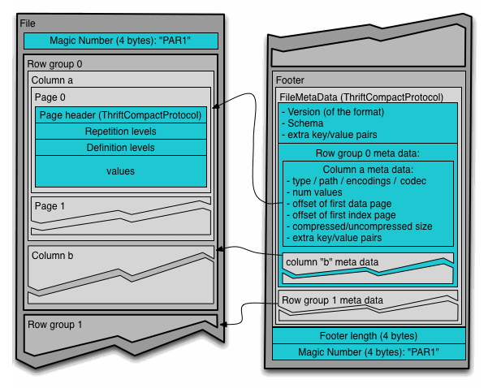

# 12/29
: DB를 공부하고 다시 읽으면 더 잘 읽혀질 것 같다.

하둡 데이터로 SQL 쿼리 프로세싱을 하는 것은 최근 인기가 있다. 
하둡에 여러 sql 서포팅을 하는 시스템 중, 하이브는 맵 리듀스와 같은 sql-like한 선언을 하는 첫 네이티브 하둡 시스템이다.

반면에 임팔라는, 하둡 위에서 병렬 데이터베이스 아키텍처를 이룩하는 새로운 sql-on-하둡 시스템이다.

둘 모두 컬럼 지향 스토리지를 통한 데이터 처리를 극대화하고, 서로 다른 파일 포맷을 지원한다. 

이 연구에서는, 이 TPC-H와 두개의 TPC-DS 워크로드를 사용하여 두 시스템의 퍼포먼스를 비교한다. 
I/O 효율성도 면밀히 연구한다. 

우리의 결과는 임팔라가 맵리듀스가 3-4배 정도 빠르고 Tez가 2.1에서 2.8배 빠르다는 것이었다.
또한, TPC-DS에서는 맵리듀스가 8.2에서 10배정도 빨랐다. 

이 이유를 알고자한다.

## Introduction
기업들은 중앙 데이터 레포지토리로 하둡을 사용한다. 이는 다양한 구조의 데이터를 관리하고 깊은 분석을 하기위해 사용된다.

그 중에 특히, SQL 프로세싱은 많은 기업의 데이터 관리 툴이 sql에 의존적이고, 그에 익숙하여 인기가 많다. 

우리는 이 하둡 시스템을 두개의 카테고리로 나눠볼 수 있다. 
1) 네이티브 하둡 기반 시스템
2) 데이터베이스와 하둡 하이브리드

첫번째 카테고리에서는, 하이브가 MapReduce와 같은 sql-like한 쿼리를 처리하는 첫 시스템이다. 
이 카테고리에서, 임팔라는 공유하지않는 병렬 데이터 베이스 아키텍처로 이동했다. 그는 그 자체의 데몬을 이용하고 중간 결과를 구체화하는 대신 파이프라이닝을 한다. 

두번째 카테고리에서는, Hadapt, Microsoft PolyBase 등이 있다. 전체적으로, 우리는 무공유 데이터베이스 아키텍처로의 수렴을 관찰했다.

이 논문에서는, 첫번째 카테고리에 집중하고, 하이브와 임팔라의 퍼보먼스를 조사한다. 
둘을 고른 것은 아키텍처가 서로 다를 뿐 아니라 둘이 인기가 많기 때문이다.
둘은 주요 하둡 분산 벤더들이 제공하는 SQL 오퍼링이다. 결과적으로, 많은 회사에서 사용한다. 
다른 것들은 회사 자체 서비스라서 널리 쓰이지는 않는다. 

하이브와 임팔라는 분석 쿼리에 사용된다. 컬럼 기반 데이터베이스는 최근 관계형 데이터베이스에서 좀 퍼포먼스를 올리는 쪽으로 보여지고잇다.
결과적으로, 많은 분석 쿼리에서 사용된다.
이 컬럼기반 데이터베이스 파일 포맷으로 여러개가 제시되었는데, 좀 퍼포먼스적으로 문제가 있었다. 
임팔라는 Parquet이라는 파일 포맷을 제시했다. 기존 것과 경합 중이다.

이 논문에서, 우리는 두개의 스토리지 포맷을 I/O 특징에서 인사이트를 얻기위해 면밀히 살핀다. 
임팔라와 하이브의 세세한 분석을 진행한다. 

### 임팔라의 데이터베이스-like 아키텍처는 큰 퍼포먼스 성과를 제공한다. 
- 하이브는 맵리듀스를 쓰는 데 있어서 스케줄링 오버헤드로 중간 결과를 쓰는 데 비용이 잇다.
- 임팔라는 반면에 쿼리 컴퓨팅 결과로 데이터를 스트림한다.

그러나, 임팔라는 중간 쿼리 실패 회복을 아직 못한다. 

- Tez는 오버헤드를 제거는 해주지만, deserialization 오버헤드를 제거하지 않아 임팔라보다 늦다.

### 임팔라의 I/O 부차 시스템은 훨씬 빠른 처리율을 보인다. 
### Parquet 포맷은 더 효율적으로 불필요한 데이터를 전처리한다. 

이 결과로, 우리는 무공유 데이터베이스 아키텍처가 MapReduce-base 런타임보다 분석 쿼리에 더 큰 이점이 있다는 것을 알게되었다. 

## 배경
### Hive 
Hive는 수천에서 수만개의 노드를 스케일링하는 능력이 있다. 

SQL-같은 쿼리 언어를 사용한다. 이는 Tez에서는 하나로, MapReduce에서는 여러개로 쪼개져 작업된다. 
Tez는 일시적 중간 파일을 만드는 대신, 실행 단계를 통해 데이터를 연결한다. 
이는 오버헤드를 줄인다.

조인 방식과 조인 순서는 퍼포먼스에 큰 영향을 끼친다. 
하이브는 두개의 조인 방식을 제공하는데, 리파티션 조인이라고 불린다. 여러 조인 쌍이 업무를 줄이기위해 섞인다. 
두번째는 map-side 조인이다. 리파티션 조인 단계를 줄이거나 셔플을 제거하는 것이다. 

### Impala
Hive와는 다르게, 다른 프레임워크에 기대기보다는 자체의 데몬을 제공한다. 
또한 무공유 병렬 데이터베이스 아키텍처를 가지고 있다. 
impalad라고 불리는 메인 데몬 프로세스는 쿼리 계획, 조정, 실행 엔진을 가지고 있다. 

임팔라는 두개의 조인 알고리즘을 가지고 있는데, 그는 파티션과 브로드 캐스트이다. 
각각은 하이브의 리파티션이나 맵사이드와 비슷하다.

임팔라는 아주 효율적인 I/O 레이어를 가지고 이싿. 
읽기 데이터 요청을과 실제 읽기 데이터를 분리한다. 

임팔라는 여전히 워킹 셋 쿼리를 요구하여 엄격한 제한을 둔다. 

### Columnar File Formats
Columnar 데이터 조직은 disk I/O를 줄이고 더 나은 압축과 분석 쿼리에 큰 혜택을 주는 인코딩 스킴을 가능하게 한다. 

하이브는 ORC, 임팔라는 Parquet 포맷을 이용한다.

#### ORC
이는 가벼운 색인 처리로 더 나은 I/O 효율뿐 아니라 데이터 인코딩과 블록레벨 압축으로 스토리지 효율성을 제공한다. 

또한 스트라이프 형태로 다양한 행 데이터를 저장한다.

#### Parquet
효율적인 압축과 인코딩을 하기위하여 디자인되었다.

row group이라고 불리는 데이터 그룹을 만들고, 그는 컬럼 청크를 포함한다. 이는 다양한 페이지를 포함하고 디스크에 계속 쌓인다. 
페이지 레벨에서 이 압축 단계가 일어난다. 

메타데이타는 파일, 컬럼 청크, 페이지 계층 모두에 쌓인다. 
Parquet을 읽는 사람은 처음으로 어떤 쿼리가 처리돼야할지를 필터링하기위해 메타데이터를 파싱한다. 
이는 중첩 컬럼은 아직 제공하지 않는다. 

최대 1기가 바이트까지 제공한다.

## 클러스터 실험
### 작업량으로서의 TPC-H
22 읽기 전용 TPC-H 쿼리를 포함하고 리프레시 스트림은 제공하지않는다. 

TPC-H를 1000기가까지 사용한다.

하이브 맵리듀스에서는 우리는 여러 다양한 최적화를 진행했다
1) 연관 쿼리 최적화
2) 푸시다운 예측과 인덱스 필터링
3) 맵사이드 조인과 집계

여러개의 쿼리로 쿼리가 나누어질 때, 중간 결과는 일시적 테이블로 구체화된다. 하이브는 전형적으로 큰 수의 리듀스 업무를 생성하는데, 이는 나쁜 퍼포먼스를 일으킨다.
우리는 우리의 환경 속에서 최적의 퍼포먼스를 낸다는 것을 파악했다.

임팔라와 관련해서는, 테이블과 컬럼 통계를 진행했다. 
이 통계는 조인 순서와 방법을 최적화하는 데 사용됐다.

### 데이터 준비와 로드 시간
- ORC, Parquet, TXT 파일 포맷을 모두 준비했다.
- 압축 알고리즘으로 snappy, gzip, zlib 사용하는데 스내피가 성능이 좋다. 따라서, 우리는 그저 스내피 결과만 보고할 것이다.
- 우선 데이터 파일을 TPC-H생성기로 1테라 정도의 스케일로 생성, HDFS에 복사한다. 각각의 파일 포맷으로 변환한다.

### 전반적 퍼포먼스
22 TPC-H 쿼리를 진행해보았을 대, 하이브와 임팔라에서 실행 시간을 계산했다. 
일단 모든 파일 캐시를 삭제했고, 세개의 풀 런을 진행했다.
각 파일 포맷별로 세번을 진행했고, 평균 반응 시간을 쟀다.

임팔라가 기사, 산술 평균에서 압도적으로 좋은 성과를 내었다.
Parquet보다 txt 형식일 때, 압도적으로 더 빠르지는 않았다. 게다가, snappy 압축은 임팔라의 퍼포먼스를 더 향상시키지는 않았다. 

이는  I/O는 임팔라의 보틀넥이 아니라는 것을 말한다. 
반면에, ORC를 사용하니 하이브의 퍼포먼스는 30%정도 향상했다.

이를 통해 임팔라는 하이브보다 훨씬 TPC-H쿼리를 효율적으로 다룬다는 것을 결론냈다.

1) 임팔라는 훨씬 효율적인 I/O 시스템을 가지고 있다. 
2) 그 자체의 데몬 프로세스에 의존하여 작업 시작 오버헤드가 없다. 
3) 임팔라의 쿼리 시행은 파이프라이닝된다. 이는 하이브의 맵리듀스가 데이터 구체화를 각 스텝에서 진행하는 것과는 반대된다. 

#### 쿼리 1
lineitem 테이블을 스캔하는데, 부등식 술어를 적용해 몇개의 열을 투영하고 수행한다. 
이 쿼리는 얼마나 I/O 레이어가 효율적으로 구성되었는지를 알려주고, 각 파일 포맷 영향을 보여준다.

- Hive-MR에서, 쿼리는 두개의 맵리듀스 잡으로 이루어져있다. 
  - 맵 단계에서, MR1은 lineitem 테이블을 스캔한다.부분적 집계를 진행한다. 리듀스 단계에서, 전체적인 집계를 한다. 
  - MR2는 MR1에서 나온 결과를 읽고 정렬한다. 
  - txt에서 ORC로 바꾸면 2.3배 속도가 빨라진다. 그를 ㅇ바축하면 더 빨라진다.
- 임팔라는 쿼리를 세 분류로 나눈다. F0/F1/F2
  - F2는 스캔하고, 예측하고, 부분적 집계를 한다. 
  - 이 결과는 그룹핑 열의 값에 기반하여, 각 노드는 셔플된다.
  - 그루핑 열의 4개의 서로 다른 값이 있기에, 4개의 노드만 데이터를 받는다. 
  - F1은 이 부분적 집계를 합치고, 각 네개의 노드에 1개의 row를 만든다. 
  - 그 다음 F0으로 스트림되어, 집계하고 정렬한다. 
  - F0 시간은 거의 밀리초 단위였고, Parquet 파일은 3.4배 정도 시간을 줄여주었다. 
- 이 모두를 통하여 봤을 때, Hive-MR보다 임팔라가 훨씬 빠른 I/O 읽기 시간을 보여주었다. 
  - 그 이유는 맵리듀스가 큰 파일을 읽을 때 오버헤드가 많기 때문이다. 
- 그러나, 우리는 스캔 과정에서 하이브와 Tez 모두가 CPU 연산이 더 크다는 것을 발견했다. 

- 임팔라는 각각의 노드에 하나의 impalad를 돌린다. 또한 각각에서 스캔과 읽기 스레드를 돌려서 더 효율적으로 프로세싱한다. 
  - 기본 있는 스토리지 시스템으로부터 바이트를 읽어 그를 스캐너에 보낸다. 
  - 이 멀티스레드 실행모델은 다른 것들보다 훨씬 효율적이다.
  - 또한 ORC 파일에 비해 Parquet파일이 훨씬 크기가 작다. 

#### 쿼리 17
- 임팔라가 하이브에 비해 2배 빠르다. 다른 쿼리에 비하여 크게 더 성능이 좋지는 않은 것이다. 
- 이는 하이브-MR의 연관 최적화가 쿼리 최적화 플랜을 짰기 때문이다.
  - 맵 단계에서, lineitem과 다른 테이블은 스캔되고, 이 예측은 적용되며 부분 집계가 l_partkey를 통해 진행된다. 
  - JOIN1과 AGG1이 하나의 스캔을 공유한다. 이는 퍼포먼스 향상을 일으키게된다. 
  - 리듀스 단계에서, 전역 집계가 일어나고, 두개의 조인이 실행된다. 
  - 여기서 CPU-bound가 일어난다.
- 임팔라는 AGG1이나 JOIN1을 분별하지못한다. 그래서, 두번 똑같은 테이블을 스캔한다.
  - 그러나, 이는 큰 영향은 아니다. 캐싱되기 때문이다.
  - 게다가, 임팔라는 데이터 구체화를 피하여 오버헤드를 막는다. 
  - 이는 쿼리를 다섯부분으로 나누어, 테이블을 먼저 스캔들을 하고, 이를 합치고, 그 결과를 모든 노드에 보낸다. 
  - 이 모든 결과는 조인되어 마지막으로 스트림되고 집계를 합친다. 
  - 임팔라는, 브로드캐스트를 통하여 조인을 한다.
  - 하나의 CPU만 사용되고 100%사용되었다. 싱글스레드를 사용하기 때문이다. 
  - 디스크는 약 10% 사용되었다. 
- 결론을 내려보면, HIVE-MR의 연관 최적화는 HIVE-MR과 임팔라의 차이를 줄여준다고 할 수 있겠다. 
  - 왜냐하면 쓸데없는 스캔을 피하고, 하나의 맵리듀스 job으로 다양한 작업을 합치기 때문이다. 
  - HIVE-MR에 비하여 HIVE-Tez는 큰 성과가 없었다. 왜냐하면 그는 작업 시작이나 스케줄링이나 맵리듀스의 구체화 오버헤드는 줄여주지만, 같은 테이블을 두번 돌기 때문이다. 

#### 쿼리 19
- HIVE-MR이 미세하게 임팔라보다 빠르다.
  - 이 쿼리는 두개의 테이블 사이의 조인을 하고 예측을 한다. 그 후에 집계가 이뤄진다. 
- HIVE-MR는 우선 MR1, MR2 잡으로 나뉘고, 
  - 일단 두 테이블을 스캔하고, 다음에 조인을 진행한다. 
  - MR2는 이전의 작업 결과를 읽고 전역 집계를 한다. 
- 임팔라는 세부분으로 나누어 작업을 진행한다. F0, F1, F2
  - F0은 한 노드에서만 일어난다. 
  - F2는 하나의 테이블을 스캔하여 다른 모든 노드들에 전파한다. 
  - F1는 해시 테이블을 다른 테이블에 만들고, 서로 다른 테이블끼리 해시 조인을 시킨다. 
  - 이 조인 과정에서 복잡한 예측 쿼리가 평가된다. 또한 그 다음에 평가된 로우가 집계된다.
  - F1의 결과가 F0에 전파된다. 이는 전역 집계를 하고 마지막 결과를 내보낸다. 
  - F2 과정동안 브로드캐스트 때문에 네트워크 활동이 증가한다. 
  - 쿼리 시간은 사실 F1에서 많다. 
- HIVE-MR이 훨씬 데이터를 읽는 것은 느리다.

#### 쿼리 22
- HIVE-MR에 비해 임팔라가 15배 빠르다. 
  - 3개의 하위 쿼리가 돌고있는데, 하나는 customer 테이블을 스캔하여 임시 테이블에 결과를 구체화한다. 
  - 두번째는 그 테이블을 통한 부등식 술어예측을 하고, 임시 테이블 결과를 구체화한다. 
  - 세번째는 orders 테이블 집계, 그러고 바깥조인을 한다. 
  - 마지막으로 바깥조인과 두번째 쿼리 결과를 합친다. 
- Hive-MR은 ORC 파일을 썼을 때 오히려 하위 쿼리 처리에 시간이 미세하게 증가한다. 
  - 임시 테이블은 크기가 적어서, 오히려 이를 만들고 압축하는 오버헤드가 크다. 
  - Hive-MR은 여기서 7개의 맵리듀스 잡을 한다.
  - 오히려 Tez가 오버헤드를 줄여서 3.5배의 향상을 보였다. 
- 임팔라는 파일 포맷에 따라 20배는 가까이 하위 쿼리 시간을 줄인다. 
  - 이는 임팔라가 더 효율적인 I/O 시스템을 가지고 있기 때문이다. 
  - 하위쿼리 둘에서 시간을 많이 줄이고, 마지막 쿼리에서 많은 시간을 보낸다. 
  - 그 이유는 이 쿼리들은 스캔하고 구체화하는 양이 적기 때문이다. 
  - 마지막 쿼리는 7개의 부분들로 나누어 진행한다. 

### 임팔라에서 런타임 코드 생성 효과
CPU 효율과 쿼리 실행 시작을 개선하기위하여, 런타임에 코드를 생성할 수 있는 것은 아주 좋은 능력이다. 
많은 오버헤드를 줄이기 위하여 임팔라는 그리한다. 

이 런타임 코드의 효과를 검사한다. 연속적으로 쿼릴르 진행하고, 런타임 코드 유무에 따른 시간을 계산한다. 

런타임 코드 실행 가능함으로써, 쿼리 실행 시간은 1.3배 줄엇다. 
실질적으로 성과 오버헤드를 부과하는 게 없다. 그렇지만 쿼리에 따라 효과는 다르다고 할 수 있다. 

### TPC-DS 영감받은 엔터티
TPC-DS 벤치마크로 엔터티를 사용한 클러스터 실험을 한다. 

20개의 쿼리를 가진 엔터티를 가지고 실험한다.
- 임팔라는 현재 윈도잉 함수와 롤업을 지원하지않기에, TPC-DS는 조금 변형되었다. 
- 필터링 예측 값은 스케일 요소에 따라서 달라진다. 
- 완전성을 위하여, 우리는 같은 엔터티를 사용하는 두번째 실험을 한다. 그러나 명확한 파티셔닝 예측은 없애고, 정확한 예측 값을 사용한다. 

- 결과는, 임팔라가 빠르다는 것이었다. 
  - 쿼리 실행 계획은 같은 패넡을 띤다: 
    - 임팔라가 작은 테이블을 브로드캐스팅하고, fact table과 파이프라이닝을 해서 조인한다.
    - 임팔라 성과는 또한 효율적인 I/O 시스템에서 나타난다. 
    - Hive-MR은 각각의 테이블을 스캔하여 진행하므로 훨씬 느리다. 다양한 맵리듀스를 실행할 수록, 더 느려진다. 
  
## MICRO-벤치마크 결과
### 실험 환경
- 세 데이터 파일을 200기가로 형성하였다. 
- 각 데이터셋은 서로 다른 숫자 컬럼을 포함한다. 
- 같은 데이터 타입을 사용한다. 
- 컨트롤 노드와 계산 노드가 있다.
- 압축 파일은 이용하지 않는다.

### 스캔 성과 

1) 파일 컬럼 수
2) 처리된 컬럼 수
3) 컬럼 접근 패턴
을 다르게 하여, 실험에서 해당 조건에 따른 I/O 처리율을 측정한다.

고정된 컬럼 퍼센트와 레코드를 스캔한다. 두개의 컬럼 접근 패턴을 실험했다. 
하나는 연속, 하나는 랜덤이다. 

결과적으로, 랜덤 접근 패턴은, 데이터 스키핑이 일어날 수 있다. 

- 연속 컬럼 접근에서, 임팔라 리드 처리율은 거의 일정하다. 
  - 흥미로운 것은 1000개의 컬럼보다 100개가 더 처리율이 좋고
  - 10개의 컬럼은 접근한 컬럼이 증가할수록 처리율이 증가한다는 것이다. 
  - 이를 통해서 평곤 CPU 사용이 1000개가 더 많다는 걸 알 수 있다. 
  - 포맷은 같은 사이즈지만 레코드는 다른 사이즈다. 
    - 10개의 컬럼 파일이 더 많은 레코드를 가지고 있다. 왜냐면 리드 처리율이 접근한 컬럼 증가수만큼 증가하기 때문이다. 
    - 몇개 안되는 컬럼이 있다면, 튜플 구체화가 러닝 타임을 지배한다. 

- 랜덤 접근에서, 접근한 컬럼 수가 많아질 수록 처리율은 높아진다. 
  - 그러나 이는 연속 접근보다는 낮다. 

- Hive-MR 실험에서는, 접근 패턴과는 독립적인 결과가 나온다는 걸 알 수 있다. 
  - 이는 높은 오버헤드 때문이다. 
  - 하나를 하든 1000개의 컬럼을 하든 120초가 똑같이 나온다.

- 10개의 컬럼과 100개의 컬럼일 때 필요한 많은 데이터를 읽어온다는 걸 알 수 있다. 
  - 나쁜 경우, 임팔라는 필요한 데이터의 2배를 읽어온다.
  - Hive-MR은 효율적으로 컬럼을 스킵하지 못한다. 
  - 그래서 사전에 전체적인 실행을 하는 것은 중요하지않다. 
  

### ORC 파일에서의 색인처리 효과
내장 색인으로 데이터를 건너뛸 수 있다. 
정렬과 비정렬된 데이터셋을 사용한다.
- 컬럼이 소팅되어있을 때 인덱스가 더 쓸모있다. 
- 아니면 효율적인 행 그룹을 스킵할 수 있는 자연스러운 순서가 있으면 쓸모있다.

## 결론
임팔라가 중요한 성과를 보였다. 만약 엔터티 워킹 셋이 메모리에 맞으면. 
퍼포먼스는 I/O의 효율적 시스템과 파이프라인 쿼리 실행에 따라 달라진다. 