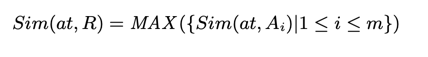

# 12/23 

SQL은 사용자가 데이터베이스의 정확한 스키마를 아는 것을 요구하기 때문에, 관계형 데이터베이스에서 쿼리를 날리는 것은 종종 어렵다. 
반면에, 키워드 검색은 원하는 쿼리 문법을 표현하긴 어렵다.

이 논문에서는 사용자가 부분적으로 스키마를 알지라도 쿼리할 수 있게 스키마 없는 SQL을 제안한다. 
스키마 없는 SQL은 어떤 릴레이션이 포함되었고 조인되었는지와 관련하여 정보를 요구하지 않는다. 

이를 평가하기위해 Full SQL로 스키마 없는 SQL를 변환한다. 
실험적으로는 적은 스키마 정보일 때, 정확하다는 걸 발견했다. 

## Introduction
정규화는 완벽한 스키마의 이해를 요구한다. 
그러나 쿼리가 예상가능하지 않을 때, SQL은 임시변통으로 사용할 쿼리를 지원하지는 않는다.

이 문제를 해결하기위해, 키워드 검색이라는 개념이 있었다. 
사용자는 쿼리 언어나 데이터베이스의 논리적 구조를 몰라도된다. 
몇의 키워드만 타이핑하면 되는데, 이는 본질적으로 모호한 부분이 있다. 
적절히 구조 정보가 명확화된 것이 아니면, 완벽한 쿼리 결과를 볼 수 없다. 그리고, 비교나 계산같은 SQL이 제공하는 함수가 보통 없다.

우리는 정확한 스키마 정보의 부담 없이 쿼리를 확실히 하고, 동시에 키워드 검색 결과를 하지 않도록 하는 수단을 제공하고자 한다. 

키워드 서치는 메타데이터의 키워가 아니라, 데이터베이스의 키워드를 찾게한다. 
이는 정확히 키워드를 적어야만 하는 문제가 있다.
게다가, 키워드는 집계 함수같은 것을 사용하지 못한다. 

따라서, 키워드 또한 구조화를 해야한다.

스키마 없는 SQL은 SQL쿼리를 작성하는 데 있어 사용자의 부담을 줄여준다. 
1. 스키마 경감: 사용자는 스키마 요소를 정확히 특정하지 않아도 된다.
2. Join 경로 경감 : 조인 경로를 특정하지 않아도 된다.

어느 정도까지는 유저가 요소 이름이나 조인 경로를 예측할 수 있다면, 사용자는 그를 포함할 수 있어야한다.

일단 사용자가 쿼리를 쓰면, 쿼리 프리 SQL은 그를 기반으로 관계 트리를 만들어본다.
또한 조인 경로를 만드는 과정에서, 스키마 그래프를 변형한 뷰 그래프를 만든다. 

이 연구가 공헌하는 바는 다음과 같다.
1. 스키마 없는 SQL 프레임워크
2. 시스템 아키텍처
3. 릴레이션 트리 
4. 뷰 그래프

## Overview
### 구문 및 의미
1. 스키마 경감: 물음표로 그들이 확실하지 않음을 드러낸다.
   - SELECT문에서 속성이 명확하지 않을 때, foo?를 적는다
   - ?x는 그 이름에 확신이 없을 때 적는다
   - ?라고 하면 그냥 더미 변수를 적어준다.
    스키마 요소를 말할 필요도 없다. 

2. 조인 경로 경감: 
   - FROM 구문을 쓸 필요도 없고, 
   - 외래키-프라이머리 키를 안써도 된다. 
   
### 아키텍처
두 가지를 경감한 뒤에, 전형적인 SQL 쿼리문으로 번역해서 쿼리 결과를 내보낸다. 

Relation Tree MApper는 스키마 경감을 위해 사용되고, NetworkBuilder는 조인 경로 경감을 돕는다. 
이 두 메인 모듈은 스키마 프리 SQL파서에 의해 진행되고 SQL composer에 의해서 계승된다.

1. 스키마 프리 SQL 파서
   유저들이 특정하는 조인 경로나 요소들은 불명확하고 파편화되어있다. 스키마 프리 SQL 파서는 스키마 요소들과 조인 경로를 나머지 쿼리와 분리한다.
   - Relation Trees라는 이름으로 요소는 표현될 것이고, views라는 이름으로 조인 경로는 대표될 것이다.

2. Relation Tree 매퍼
    - 릴레이션 트리와 데이터베이스의 릴레이션 사이의 유사성을 평가하고, 그 유사성에 의해 매핑한다.

3. 네트워크 빌더
    - Full SQL쿼리를 잡아내려면, 정확한 조인 네트워크를 형성해야한다. 
    - 네트워크 빌더는 뷰 그래프를 통해 네트워크를 만들어내는데, 
    - 이는 더 정확해보인다

4. Standard SQL 구성체
    - 정확한 스키마 요소를 만들어낸다. 
    - 각각의 구문을 채워가며, 완벽히 구성된 SQL 쿼리를 만든다. 

5. 중첩 쿼리
    - 위 1-4는 하나의 쿼리만 이야기하는데, 중첩 쿼리가 주어졌으 ㄹ때, 가장 밖의 쿼리부터 하나하나 진행한다.

## 스키마 프리 내용 소개
우리는 요소 이름이나 구조를 추측한다. 요소값을 받으면 어떤 속성인지 추측할 수 있는 힌트를 받는다. 
릴레이션 트리를 만드는 과정에서, 우리는 릴레이션 이름, 속성명, 값 조건을 구성하는 스키마 연관 내용을 명시한다.

### 세개의 표현식
- 릴레이션명 (From 구문)
- 속성명
- WHERE 구문에서 사용되는 구체적인 이름

이 외에는 스키마와 연관되어있지 않다고 생각된다.
만약 표현식이 세개의 표현을 특정하지 않으면, 우리는 별표시를 해놓는다. 

### 릴레이션 트리
저 세개의 표현식은 서로 독립적이지는 않다. 
1) 분명한 릴레이션명은 릴레이션 레벨에서 머지된다
2) 릴레이션명과 속성명은 속성 레벨에서 머지된다
3) 속성명은 명확한데 릴레이션 명이 없다면 속성레벨에서 머지된다.

이 머지된 결과를 릴레이션 트리라고 한다. 유사하게 속성레벨에서의 부트리는 속성트리라고 한다.
전처리 후, 모든 스키마 연관 정보는 릴레이션 트리의 셑으로 변환된다. 우리는 이것을 l-릴레이션 트리쿼리라고 한다. 

- l-키워드 검색보다는 l-릴레이션 트리가 더 많은 정보를 가지고 있다. 
- l-키워드 검색에서는 모든 키워드를 가지고 있는 조인 네트워크나 릴레이션들은 평가된 뒤에 랭크된다. 반면 l-릴레이션 트리는 평가 전에 랭크된다.

## 릴레이션 트리 매핑
1) 유사성 평가

   n(rt)는 릴레이션 명이 n인 릴레이션 트리, R은 데이터베이스 릴레이션, at은 속성트리
2) 루트레벨 유사성

   - 릴레이션 트리의 뿌리에 릴레이션명이 있다면, 이 이름은 주된 힌트가 될 것이다. 
   - 사용자는 자주 이 릴레이션 명을 빼먹는다.
   - 이를 허용하기 위하여, 우리는 이웃 릴레이션 이름과 루트 릴레이션 이름을 매치한다.
   - 어떤 경우에는 n(rt)가 특정되지 않는다. 이 경우, 속성테이블에서 힌트를 얻는다. 
3) 속성레벨 유사성
