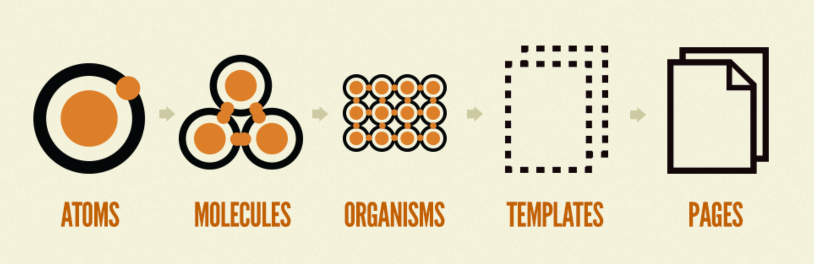

## Presentation and Container Component Pattern
➡️ 데이터 처리와 데이터 출력을 분리하는 패턴

### ✏️ Container Components : how things work
- 컨테이너 컴포넌트에서는 주로 데이터 fetch가 이뤄짐

- Redux를 이용해 상태 관리를 하게 된다면 dispatch예. 연관이 있는 서브 컴포넌트를 렌더링.

- DOM Markup 이나 스타일(css)가 없다.

- Presentational 또는 Container Components에 callback 함수나 데이터를 전달해 줄 수 있다.

- stateful한 경향을 가지고 있는 컴포넌트.

### ✏️ Presentational Components (FC) : how things look
➡️ 화면에 보여지는 것만을 담당하는 Components

- DOM markup 과 style(css)를 가짐

-props를 통해서 데이터나 callbacks 받아옴.

-뷰에 필요한 state를 가지고 있을 수 있음

- state, lifecycle, Performance optimization이 필요한 경우가 아니면 Functional component로 작성.

- stateless한 경향을 가지고 있는 컴포넌트.

### ✏️ 장점
1. 관심사의 분리
2. 재사용성
3. 마크업 작업 편함

## Atomic Design Pattern
➡️ 디자인 요소들을 나누어 파악하고 이 요소들이 조합되는 과정을 통해서 디자인을 구성하는 방식

###⚛️ Atoms
➡️ 하나의 구성 요소. 본인 자체의 스타일만 가지고 있으며 다른 곳에 영향을 미치는 스타일은 적용되지 않아야

###⚛️ Molucules
➡️ Atoms가 모여서 만들어지는 하나의 구성 요소

###⚛️ Organisms: 분자들의 모음
➡️ Organisms(유기체)는 Molucules 모음으로 비교적 복잡한 구조를 가짐

### ⚛️ Templates: 유기체들을 모아 템플릿으로 생성, 스타일링에 집중한 단위

###⚛️ Pages: 실제 페이지를 구성
