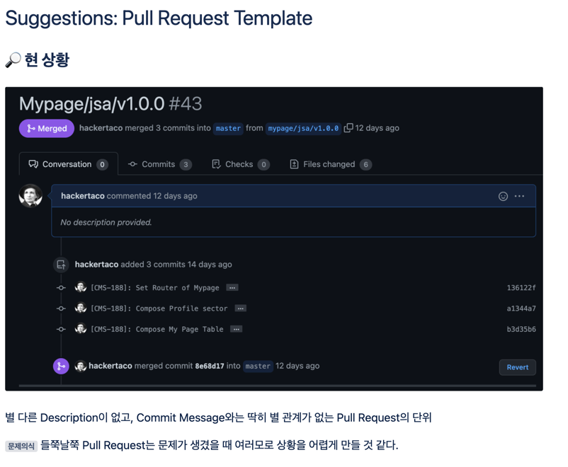

###🔎 현 상황

별 다른 Description이 없고, Commit Message와는 딱히 별 관계가 없는 Pull Request의 단위
문제의식 :: 들쭉날쭉 Pull Request는 문제가 생겼을 때 여러모로 상황을 어렵게 만들 것 같다.

###🔎 필요성?
0. 리뷰어에게 제 커밋을 받아달라고 요청
1. 풀 리퀘스트에는 여러 커밋들이 들어있다. <=실질적 목적
이 커밋들을 왜 했는지, 체계적으로 한번에 묶어줄 단위가 필요하다.
2. 조금 더 신중한 커밋을 위해

###📍 방향
#### 우선순위
1. 체계성
2. 리뷰요청

### 내용
**1 Pull Request = 1 Jira Sub-task 기조**

제목: [지라카드] 브랜치명

- 무슨 이유로 코드를 변경(생성)했는지 → Why (여기에 Jira Sub-task 카드 넣으면 될 것)

- 어떤 방향성을 가지고 어떤 변화를 만들었는지 -> How, What (Why가 중요한 Pull Req라, how나 what은 간략히)

- 어떤 부분에 리뷰어가 집중하면 좋을지 (Optional)

- 관련 스크린샷 (Optional)

- 테스트 체크리스트 또는 완료 사항 (우려되는 상황)

**만약 Jira Sub-task가 아니라면?**

제목: [Non-Jira] 브랜치명

- 무슨 이유로 코드를 변경(생성)했는지 → Why (여기에 Jira Sub-task 카드 넣으면 될 것)

- 어떤 방향성을 가지고 어떤 변화를 만들었는지 -> How, What (Why가 중요한 Pull Req라, how나 what은 간략히)

- 어떤 부분에 리뷰어가 집중하면 좋을지 (Optional)

- 관련 스크린샷 (Optional)

- 테스트 체크리스트 또는 완료 사항 (우려되는 상황)

###📐 실제 템플릿

제목ㅣ [AC-3] MyPage/jsa/v1.0.0

내용

## Why Need This Change?

- 1이유
- 2이유

## Resolve Direction/What Changed

어떤 방향으로 해결하려고 노력1

- 그래서 한 것1
- 그래서 한 것 2

## Test Checklist/Code Impact (Optional)

테스트 체크리스트

- 체크리스트1
- 체크리스트2

코드가 줄 변화(우려사항)

- 변화1
- 변화2

## What Do Reviewers See? (Optional)

- 주목할 점 1
- 주목할 점 2

## Relevant ScreenShot (Optional)

스크린샷
